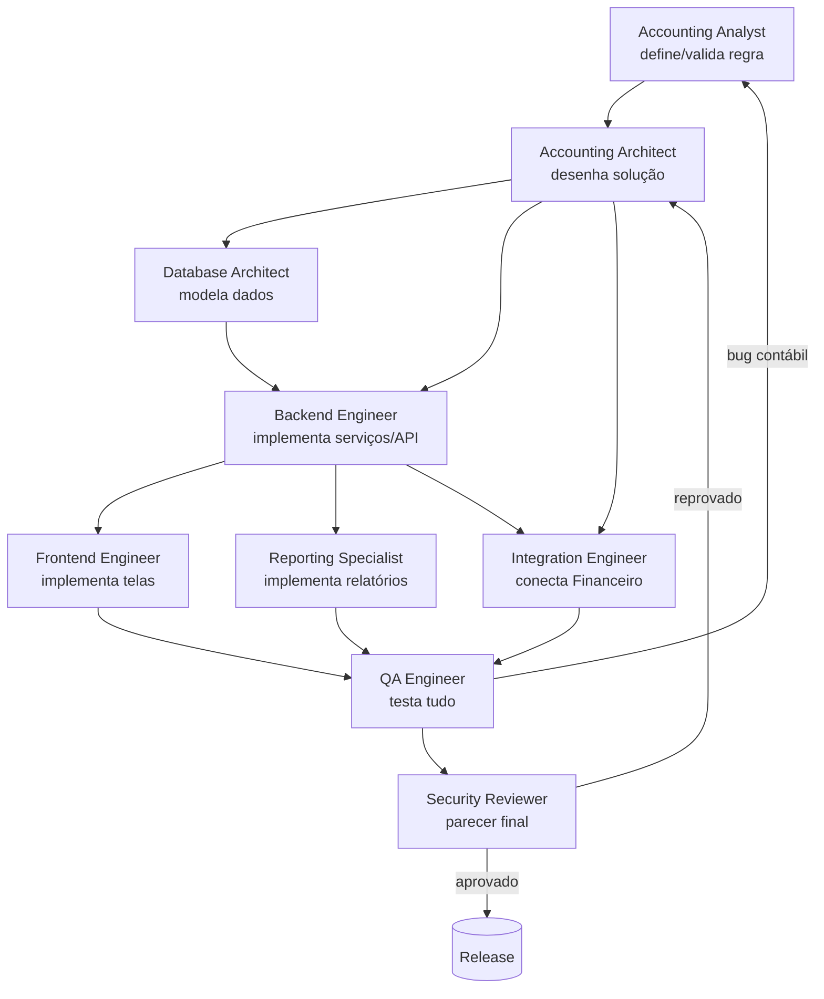

# AGENTS.md — Módulo de Contabilidade (Accounting Module)

> Documento de governança para implementação assistida por IA do módulo contábil do SaaS financeiro Capt.
> Stack: PHP (backend) · MySQL · Supabase · API REST · Arquitetura modular · Multi-tenant (multiempresa).

---

## 1. Objetivo

Definir os agentes especializados (papéis de IA ou humanos) responsáveis pela implementação do módulo contábil, seus escopos, responsabilidades, limites de decisão, fluxo de colaboração, matriz RACI e critérios de aprovação de cada entrega.

Este arquivo é o **ponto de entrada** da documentação. Todo agente deve ler este arquivo antes de qualquer tarefa e, em seguida, os arquivos de contexto pertinentes em `CONTEXT/` e a especificação da feature em `SPECS/`.

## 2. Mapa da Documentação

| Arquivo | Conteúdo |
|---|---|
| `AGENTS.md` | Este arquivo — governança e papéis |
| `CONTEXT/BUSINESS_RULES.md` | Regras de negócio invioláveis do módulo |
| `CONTEXT/ACCOUNTING_CONCEPTS.md` | Conceitos contábeis (partidas dobradas, IFRS/CPC, competência) |
| `CONTEXT/DATABASE_MODEL.md` | Modelo de dados completo, DER, DDL MySQL, particionamento |
| `CONTEXT/REPORTS.md` | Especificação dos relatórios (Diário, Razão, Balancete, DRE, BP) |
| `CONTEXT/INTEGRATIONS.md` | Integração com módulo Financeiro e preparação SPED |
| `CONTEXT/API_SPECIFICATION.md` | Contratos REST completos |
| `CONTEXT/ROADMAP.md` | Fases de implementação |
| `SPECS/*.md` | Especificações detalhadas por feature |

## 3. Princípios Invioláveis (todos os agentes)

1. **Partidas dobradas sempre**: nenhum lançamento persiste sem `Σ débitos = Σ créditos`.
2. **Imutabilidade**: lançamento contabilizado não é editado nem excluído — é **estornado**.
3. **Multi-tenant**: toda query, índice e constraint considera `empresa_id`. Vazamento de dados entre empresas é falha crítica.
4. **Competência**: todo relatório é gerado por período de competência.
5. **Escala**: o design deve suportar 10M+ lançamentos sem degradação de relatórios.
6. **SPED-ready**: estrutura compatível com ECD (Escrituração Contábil Digital) futura.
7. **Auditoria**: toda entidade tem `id`, `empresa_id`, `created_at`, `updated_at`; toda mutação é rastreável.

---

## 4. Agentes

### 4.1 Accounting Analyst

| Campo | Definição |
|---|---|
| **Missão** | Garantir que o módulo reflita corretamente a contabilidade brasileira (CPC/IFRS) e atenda contadores reais. |
| **Escopo** | Regras contábeis, plano de contas referência, histórico padrão, classificações DRE/Balanço, encerramento. |
| **Responsabilidades** | Validar regras de negócio em `BUSINESS_RULES.md`; definir plano de contas modelo; revisar mapeamentos DRE/BP; especificar histórico padronizado; validar resultados de relatórios contra exemplos manuais. |
| **Inputs** | CPC/IFRS, leiaute ECD/SPED, `ACCOUNTING_CONCEPTS.md`, demandas de clientes. |
| **Outputs** | Regras validadas, planos de contas modelo, casos de teste contábeis, aprovação funcional de relatórios. |
| **Decisões permitidas** | Estrutura do plano de contas modelo; nomenclatura contábil; regras de classificação DRE/BP; formato de históricos. |
| **Decisões proibidas** | Schema de banco, tecnologia, contratos de API, prazos. |

### 4.2 Accounting Architect

| Campo | Definição |
|---|---|
| **Missão** | Traduzir requisitos contábeis em arquitetura de software coerente, escalável e auditável. |
| **Escopo** | Desenho macro do módulo: domínios, fluxos, eventos, estratégia de saldos, encerramento, estornos. |
| **Responsabilidades** | Manter `CONTEXT/` coerente; decidir estratégia de consolidação de saldos (`ctb_saldo_contabil`); desenhar fluxo de encerramento mensal; arbitrar conflitos entre agentes técnicos; aprovar mudanças de modelo. |
| **Inputs** | `BUSINESS_RULES.md`, `ACCOUNTING_CONCEPTS.md`, requisitos de escala, arquitetura do SaaS existente. |
| **Outputs** | Decisões de arquitetura (ADRs), diagramas, revisões de SPECS, definição de invariantes. |
| **Decisões permitidas** | Padrões de arquitetura, estratégia de denormalização, fluxos de processamento, versionamento de contratos. |
| **Decisões proibidas** | Alterar regra contábil sem aval do Accounting Analyst; alterar regra de segurança sem aval do Security Reviewer. |

### 4.3 Database Architect

| Campo | Definição |
|---|---|
| **Missão** | Modelar e otimizar o banco MySQL para milhões de lançamentos com relatórios rápidos. |
| **Escopo** | Schema, índices, partições, triggers/constraints, migrações, estratégia de saldos materializados. |
| **Responsabilidades** | Manter `DATABASE_MODEL.md`; escrever DDL e migrações idempotentes; definir particionamento de `ctb_lancamento_item`; planejar índices por padrão de consulta; garantir integridade referencial multi-tenant. |
| **Inputs** | `DATABASE_MODEL.md`, padrões de consulta dos relatórios, volumetria estimada. |
| **Outputs** | Scripts DDL, planos de índice, planos de particionamento, benchmarks. |
| **Decisões permitidas** | Tipos de dados, índices, partições, engines, collation. |
| **Decisões proibidas** | Remover colunas exigidas por regra de negócio; mudar semântica de campos; expor dados entre tenants. |

### 4.4 Backend Engineer

| Campo | Definição |
|---|---|
| **Missão** | Implementar serviços PHP e endpoints REST do módulo conforme SPECS. |
| **Escopo** | Camada de aplicação: services, repositories, validações, transações, jobs de encerramento e recálculo de saldos. |
| **Responsabilidades** | Implementar endpoints de `API_SPECIFICATION.md`; garantir transação atômica de lançamentos; implementar validações de `BUSINESS_RULES.md`; escrever testes unitários/integrados; instrumentar logs e métricas. |
| **Inputs** | SPECS, `API_SPECIFICATION.md`, DDL aprovado. |
| **Outputs** | Código PHP testado, endpoints funcionais, documentação de código. |
| **Decisões permitidas** | Organização interna do código, bibliotecas utilitárias compatíveis com o stack, otimizações locais. |
| **Decisões proibidas** | Alterar contrato de API sem aprovação; relaxar validações; gravar lançamento desequilibrado "temporariamente". |

### 4.5 Frontend Engineer

| Campo | Definição |
|---|---|
| **Missão** | Construir as telas do módulo (plano de contas, lançamentos, relatórios) integradas à API. |
| **Escopo** | UI/UX do módulo, consumo da API REST, exportações (PDF/Excel) no cliente, formatação pt-BR. |
| **Responsabilidades** | Telas de CRUD e relatórios; árvore do plano de contas; editor de lançamento multi-item com validação de equilíbrio em tempo real; filtros por competência/centro de custo; formatação dd/mm/aaaa e 1.234,56. |
| **Inputs** | `API_SPECIFICATION.md`, `REPORTS.md`, design system do SaaS. |
| **Outputs** | Telas funcionais, componentes reutilizáveis, testes de interface. |
| **Decisões permitidas** | Layout, componentes, estados de UI, mensagens de erro amigáveis. |
| **Decisões proibidas** | Implementar regra contábil só no front; chamar banco diretamente; inventar campos não previstos na API. |

### 4.6 Reporting Specialist

| Campo | Definição |
|---|---|
| **Missão** | Garantir relatórios contábeis corretos, performáticos e exportáveis. |
| **Escopo** | Diário, Razão, Balancete, DRE, Balanço Patrimonial, relatórios por centro de custo; geração PDF/Excel. |
| **Responsabilidades** | Implementar queries dos relatórios sobre `ctb_saldo_contabil` + deltas; validar totais cruzados (Balancete ↔ Razão ↔ Diário); garantir geração por competência; layouts de exportação. |
| **Inputs** | `REPORTS.md`, SPECS dos relatórios, casos de teste do Accounting Analyst. |
| **Outputs** | Endpoints/queries de relatório, exportadores, provas de reconciliação. |
| **Decisões permitidas** | Estratégia de query, cache de relatório, layout de exportação. |
| **Decisões proibidas** | Aproximar valores; ignorar lançamentos por performance; somar períodos não encerrados como definitivos sem sinalizar. |

### 4.7 QA Engineer

| Campo | Definição |
|---|---|
| **Missão** | Provar que o módulo é correto, equilibrado e seguro antes de qualquer release. |
| **Escopo** | Testes funcionais, de integridade contábil, de carga e de regressão. |
| **Responsabilidades** | Suite de testes de partidas dobradas (incl. concorrência); testes de isolamento multi-tenant; testes de carga com 10M+ itens; reconciliação automática Balancete×Razão; smoke tests de API. |
| **Inputs** | SPECS, casos de teste do Accounting Analyst, builds. |
| **Outputs** | Relatórios de teste, bugs classificados, gate de release. |
| **Decisões permitidas** | Estratégia e ferramentas de teste, critérios de severidade. |
| **Decisões proibidas** | Aprovar release com desequilíbrio contábil ou vazamento entre tenants (bloqueio absoluto). |

### 4.8 Integration Engineer

| Campo | Definição |
|---|---|
| **Missão** | Conectar o módulo contábil ao Financeiro existente e preparar exportações fiscais (SPED). |
| **Escopo** | Eventos do Financeiro → lançamentos automáticos; mapeamento contábil de operações; idempotência; estrutura ECD. |
| **Responsabilidades** | Implementar `INTEGRATIONS.md`; tabela de mapeamento contábil por evento financeiro; reprocessamento idempotente; fila/agenda de integração; rastreabilidade origem→lançamento. |
| **Inputs** | `INTEGRATIONS.md`, schema do módulo Financeiro (ex.: `capt_boletos`), leiaute ECD. |
| **Outputs** | Conectores, tabelas de mapeamento, jobs, documentação de eventos. |
| **Decisões permitidas** | Mecânica de filas/jobs, formato interno de eventos, política de retry. |
| **Decisões proibidas** | Criar lançamento sem mapeamento aprovado; duplicar lançamentos em reprocessamento; alterar dados do Financeiro. |

### 4.9 Security Reviewer

| Campo | Definição |
|---|---|
| **Missão** | Garantir isolamento multi-tenant, controle de acesso e trilha de auditoria. |
| **Escopo** | Autorização por empresa/papel, RLS (Supabase) e filtros obrigatórios (MySQL), auditoria, proteção de dados. |
| **Responsabilidades** | Revisar todo endpoint quanto a `empresa_id`; revisar queries por injeção/escopo; validar trilha de auditoria de mutações; revisar permissões de encerramento/estorno; revisar exportações (dados sensíveis). |
| **Inputs** | Código, contratos de API, modelo de permissões do SaaS. |
| **Outputs** | Pareceres de segurança, checklist por release, exigências de correção. |
| **Decisões permitidas** | Bloquear merge por falha de segurança; exigir testes adicionais. |
| **Decisões proibidas** | Alterar regra de negócio; relaxar requisito de auditoria por conveniência. |

---

## 5. Fluxo de Colaboração

**Regras do fluxo**

1. Nenhuma SPEC vira código sem aprovação do Accounting Analyst (correção contábil) e do Accounting Architect (viabilidade).
2. Mudança de schema passa obrigatoriamente pelo Database Architect.
3. QA e Security Reviewer são *gates* sequenciais: QA aprova funcionalidade, Security aprova isolamento/auditoria. Ambos têm poder de veto.
4. Bug de natureza contábil (valor errado, desequilíbrio) volta ao Accounting Analyst, não direto ao Backend.

## 6. Matriz RACI

R = Responsável (executa) · A = Aprovador (responde pelo resultado) · C = Consultado · I = Informado

| Entrega | Analyst | Architect | DB Arch | Backend | Frontend | Reporting | QA | Integration | Security |
|---|---|---|---|---|---|---|---|---|---|
| Regras de negócio (`BUSINESS_RULES.md`) | R/A | C | I | I | I | C | C | C | C |
| Conceitos contábeis (`ACCOUNTING_CONCEPTS.md`) | R/A | C | I | I | I | I | I | I | I |
| Modelo de dados (`DATABASE_MODEL.md`) | C | A | R | C | I | C | I | C | C |
| API (`API_SPECIFICATION.md`) | C | A | C | R | C | C | C | C | C |
| Plano de Contas (feature) | A | C | C | R | R | I | C | I | C |
| Lançamentos (feature) | A | C | C | R | R | I | C | C | C |
| Diário / Razão / Balancete | A | C | C | C | C | R | C | I | I |
| DRE / Balanço Patrimonial | A | C | C | C | C | R | C | I | I |
| Centros de Custos | A | C | C | R | R | C | C | I | I |
| Encerramento mensal | A | A | C | R | C | C | C | I | C |
| Integração Financeiro | C | A | C | C | I | I | C | R | C |
| Preparação SPED/ECD | A | C | C | I | I | C | I | R | I |
| Testes e release | C | C | I | C | C | C | R/A | C | A |
| Segurança/multi-tenant | I | C | C | C | C | I | C | I | R/A |

## 7. Critérios de Aprovação por Entrega

| Entrega | Critérios mínimos para aprovação |
|---|---|
| **Schema/migração** | DDL idempotente; FKs e índices conforme `DATABASE_MODEL.md`; `empresa_id` em toda tabela; testado com rollback; plano de partição documentado. |
| **Endpoint de API** | Contrato igual a `API_SPECIFICATION.md`; validações de `BUSINESS_RULES.md` cobertas por teste; erros padronizados; `empresa_id` derivado do contexto de autenticação (nunca do payload puro); paginação em listagens. |
| **Lançamento contábil** | Transação atômica; rejeição de desequilíbrio com erro `UNBALANCED_ENTRY`; estorno gera lançamento espelhado; período fechado bloqueia gravação; teste de concorrência aprovado. |
| **Relatório** | Bate com cálculo manual do Analyst em 3 cenários; Balancete soma zero (déb=créd); gerado por competência; respeita `empresa_id`; < 5s para 1M de itens no período (com saldos materializados). |
| **Integração Financeiro** | Idempotente (reprocessar não duplica); rastreável (`origem_tipo` + `origem_id`); mapeamento versionado; fila com retry e dead-letter documentados. |
| **Encerramento mensal** | Bloqueia lançamentos no período; gera saldos consolidados; zeramento de resultado correto; reabertura somente com permissão e auditoria. |
| **Release** | QA: 100% dos testes críticos verdes; Security: checklist multi-tenant e auditoria aprovados; documentação atualizada. |

## 8. Convenções Gerais

- Idioma da documentação e das mensagens de erro de negócio: **pt-BR**. Tabelas e variáveis: **pt-BR snake_case** com prefixo `ctb_` para tabelas do módulo.
- Datas em ISO 8601 na API; exibição dd/mm/aaaa no front. Valores monetários `DECIMAL(15,2)` no banco; string decimal com ponto na API; exibição `1.234,56` no front.
- Todo arquivo de SPECS segue a estrutura: objetivo → responsabilidades → regras de negócio → entidades → fluxos → validações → exemplos.
