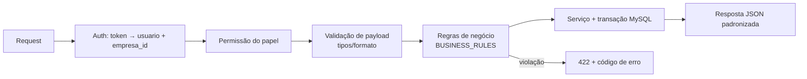

# API_SPECIFICATION.md — Contratos REST do Módulo Contábil

## 1. Objetivo

Definir todos os endpoints REST do módulo: rotas, métodos, payloads, respostas, erros, paginação, autenticação e versionamento. Backend (PHP) e Frontend implementam exatamente este contrato.

## 2. Convenções Gerais

- Base path: `/api/contabilidade` (versão via header `Accept-Version: v1`; default v1).
- Autenticação: Bearer token do SaaS. `empresa_id` é extraído do token/contexto de sessão — **nunca** aceito do body para escopo de dados.
- `Content-Type: application/json; charset=utf-8`.
- Datas: ISO 8601 (`YYYY-MM-DD`); competência mensal: `YYYY-MM`. Valores: string decimal com ponto (`"1050.00"`) para evitar float.
- Paginação: `?page=1&per_page=50` (max 200) → resposta com `meta: {page, per_page, total, total_pages}`. Listagens de alto volume aceitam `?cursor=` (keyset).
- Ordenação: `?sort=campo,-outro_campo`.
- Idempotência em POSTs de integração/lançamento: header `Idempotency-Key` (opcional para manual, obrigatório para integração).

## 3. Formato de Erro (padrão)

```json
{
  "error": {
    "code": "UNBALANCED_ENTRY",
    "message": "Débitos (500,00) diferem dos créditos (450,00).",
    "details": [{ "field": "itens", "issue": "sum_mismatch", "debitos": "500.00", "creditos": "450.00" }]
  }
}
```

HTTP: `400` malformado · `401` não autenticado · `403` sem permissão · `404` não encontrado (ou de outra empresa) · `409` conflito (duplicidade/idempotência) · `422` regra de negócio · `500` interno. Códigos de negócio: ver catálogo em `BUSINESS_RULES.md` §13.

## 4. Endpoints

### 4.1 Plano de Contas

| Método | Rota | Descrição |
|---|---|---|
| GET | `/contas` | lista (filtros: `?tipo=`, `?ativo=`, `?aceita_lancamento=`, `?busca=`, `?nivel=`) |
| GET | `/contas/arvore` | árvore hierárquica completa |
| GET | `/contas/{id}` | detalhe |
| POST | `/contas` | cria conta |
| PUT | `/contas/{id}` | atualiza (restrições RP-03/RP-06) |
| PATCH | `/contas/{id}/inativar` · `/reativar` | soft delete |
| POST | `/contas/importar-modelo` | aplica plano de contas modelo (seed) na empresa |

**POST /contas — request**

```json
{
  "codigo": "1.1.2.001.0002",
  "nome": "Clientes Exterior",
  "conta_pai_id": 45,
  "tipo": "ativo",
  "natureza": "devedora",
  "aceita_lancamento": true,
  "grupo_balanco_id": 3
}
```

**201 — response**: objeto completo com `id`, `nivel` (calculado), `empresa_id`, timestamps.
Erros: `INVALID_CODE_FORMAT`, `INVALID_HIERARCHY`, `DUPLICATE_CODE`, `UNMAPPED_ACCOUNT` (warning não bloqueante na criação; bloqueante no encerramento).

### 4.2 Lançamentos

| Método | Rota | Descrição |
|---|---|---|
| GET | `/lancamentos` | lista (filtros: `?competencia_de=&competencia_ate=&status=&origem_tipo=&conta_id=&busca=`) |
| GET | `/lancamentos/{id}` | detalhe com itens e distribuição de custo |
| POST | `/lancamentos` | cria (status `rascunho` ou direto `contabilizado` com `"contabilizar": true`) |
| PUT | `/lancamentos/{id}` | edita **apenas rascunho** |
| DELETE | `/lancamentos/{id}` | exclui **apenas rascunho** |
| POST | `/lancamentos/{id}/contabilizar` | valida e contabiliza (gera `numero`) |
| POST | `/lancamentos/{id}/estornar` | gera lançamento de estorno (body: `{"motivo": "..."}`) |
| POST | `/lancamentos/lote` | importação em lote (array de lançamentos, transacional por item, relatório de resultado) |

**POST /lancamentos — request**

```json
{
  "data_lancamento": "2026-06-04",
  "data_competencia": "2026-06-04",
  "historico_padrao_id": 12,
  "historico_complemento": "duplicata 000123 Cliente X",
  "contabilizar": true,
  "itens": [
    { "conta_id": 101, "tipo": "D", "valor": "1040.00" },
    { "conta_id": 610, "tipo": "D", "valor": "10.00",
      "centros_custo": [{ "centro_custo_id": 3, "valor": "10.00" }] },
    { "conta_id": 112, "tipo": "C", "valor": "1050.00" }
  ]
}
```

**201 — response (resumo)**

```json
{
  "id": 9876, "numero": 4502, "status": "contabilizado",
  "valor_total": "1050.00",
  "historico": "Recebimento da duplicata 000123 de Cliente X",
  "itens": [ { "id": 1, "conta": {"id":101,"codigo":"1.1.1.002.0001","nome":"Banco BTG"}, "tipo":"D", "valor":"1040.00" } ]
}
```

Erros: `UNBALANCED_ENTRY`, `PERIOD_CLOSED`, `SYNTHETIC_ACCOUNT`, `INVALID_ACCOUNT`, `MISSING_HISTORY`, `COST_CENTER_REQUIRED`, `COST_CENTER_MISMATCH`, `DUPLICATE_ORIGIN` (409), `IMMUTABLE_ENTRY`.

### 4.3 Históricos Padrão

CRUD simples: `GET/POST /historicos-padrao`, `GET/PUT/PATCH(.../inativar) /historicos-padrao/{id}`.

### 4.4 Centros de Custos

CRUD + árvore: `GET/POST /centros-custo`, `GET /centros-custo/arvore`, `GET/PUT/PATCH /centros-custo/{id}`. Regras em `SPECS/COST_CENTERS.md`.

### 4.5 Grupos DRE / Balanço

`GET/POST/PUT /grupos-dre`, `GET/POST/PUT /grupos-balanco`, `POST /grupos-dre/importar-modelo`, `POST /grupos-balanco/importar-modelo`. Inclui `GET /contas/nao-mapeadas?tipo=dre|balanco` para a tela de mapeamento.

### 4.6 Períodos e Encerramento

| Método | Rota | Descrição |
|---|---|---|
| GET | `/periodos` | lista períodos com status |
| POST | `/periodos/{ano}/{mes}/encerrar` | executa encerramento mensal (RF-03); resposta `202` com `job_id` |
| POST | `/periodos/{ano}/{mes}/reabrir` | requer permissão + `{"motivo": "..."}`; auditado (RF-05) |
| GET | `/periodos/{ano}/{mes}/validacao` | pré-checagem: rascunhos pendentes, contas não mapeadas, desequilíbrios |
| POST | `/exercicios/{ano}/encerrar` | encerramento anual (zeramento via ARE, RF-06) |

### 4.7 Relatórios

| Método | Rota | Filtros principais |
|---|---|---|
| GET | `/relatorios/diario` | `competencia_de`, `competencia_ate`, `formato` |
| GET | `/relatorios/razao` | `conta_id` (ou `codigo_de`/`codigo_ate`), competências, `centro_custo_id`, `formato` |
| GET | `/relatorios/balancete` | competências, `nivel`, `somente_com_movimento`, `centro_custo_id`, `formato` |
| GET | `/relatorios/dre` | competências, `centro_custo_id`, `comparativo=mensal|acumulado`, `formato` |
| GET | `/relatorios/balanco` | `competencia_ate`, `comparativo_com`, `formato` |
| GET | `/relatorios/centro-custo/resultado` | `centro_custo_id`, competências |
| GET | `/relatorios/centro-custo/comparativo` | competências |
| GET | `/exportacoes/{job_id}` | status/download de exportação assíncrona |

Resposta de relatório: ver exemplos em `REPORTS.md`. `formato=pdf|xlsx` com >5.000 linhas → `202 {job_id}`.

### 4.8 Integração (administração)

| Método | Rota | Descrição |
|---|---|---|
| GET | `/integracao/pendencias` | fila com filtros `?status=` |
| POST | `/integracao/pendencias/{id}/reprocessar` | reprocessa item |
| POST | `/integracao/pendencias/{id}/descartar` | `{"motivo": "..."}`, auditado |
| GET/POST/PUT | `/integracao/mapeamentos` | CRUD de `ctb_mapeamento_contabil` |
| POST | `/integracao/eventos` | **endpoint interno** usado pelo Financeiro p/ enfileirar evento (auth service-to-service) |

## 5. Permissões (papéis sugeridos)

| Permissão | Ações |
|---|---|
| `contabilidade.visualizar` | GETs de consulta e relatórios |
| `contabilidade.lancar` | criar/contabilizar lançamentos |
| `contabilidade.estornar` | estornos |
| `contabilidade.configurar` | plano de contas, grupos, históricos, centros, mapeamentos |
| `contabilidade.periodo.encerrar` | encerramento mensal/anual |
| `contabilidade.periodo.reabrir` | reabertura (restrita) |

## 6. Fluxo de requisição (middleware)



## 7. Validações transversais

1. Campo desconhecido no payload → `400 VALIDATION_ERROR` (modo estrito, evita typo silencioso).
2. `id` de outra empresa → `404 NOT_FOUND` (não vazar existência — nunca 403).
3. Datas inválidas/competência malformada → `400`.
4. Rate limit em relatórios pesados: 10 req/min por usuário → `429`.

## 8. Exemplo de erro completo

```http
POST /api/contabilidade/lancamentos → 422
```

```json
{
  "error": {
    "code": "PERIOD_CLOSED",
    "message": "O período 05/2026 está fechado. Lançamentos não são permitidos.",
    "details": [{ "field": "data_competencia", "periodo": "2026-05", "status": "fechado" }]
  }
}
```
