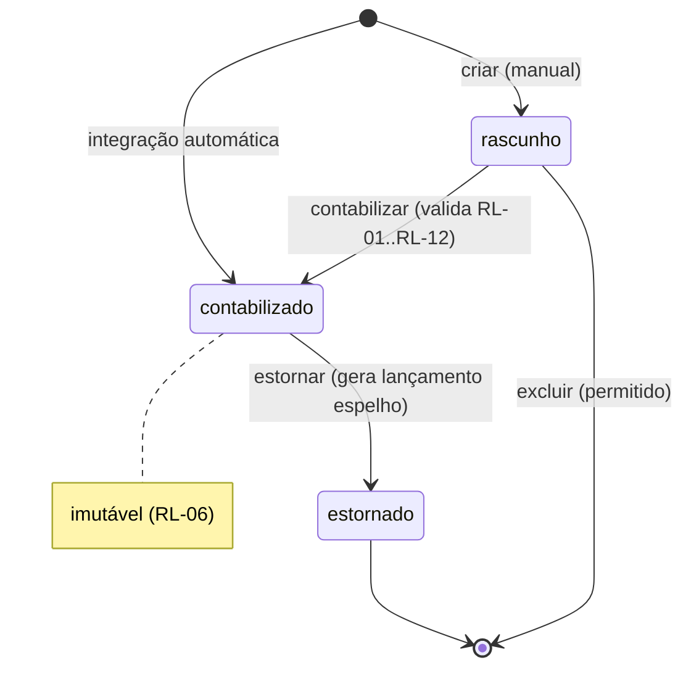

# BUSINESS_RULES.md — Regras de Negócio do Módulo Contábil

## 1. Objetivo

Consolidar todas as regras de negócio invioláveis do módulo contábil. Qualquer implementação (backend, frontend, integração, relatório) deve obedecer a estas regras. Em caso de conflito entre documentos, **este arquivo prevalece** sobre SPECS; `ACCOUNTING_CONCEPTS.md` prevalece sobre este em questões de doutrina contábil.

## 2. Responsabilidades

- Servir de fonte única de verdade para validações de negócio.
- Definir códigos de erro padronizados para cada violação.
- Estabelecer invariantes verificáveis por testes automatizados.

## 3. Regras Estruturais (toda entidade)

| # | Regra | Erro |
|---|---|---|
| RE-01 | Toda tabela do módulo possui `id` (BIGINT UNSIGNED AUTO_INCREMENT, PK), `empresa_id` (BIGINT UNSIGNED, NOT NULL), `created_at` e `updated_at` (DATETIME, NOT NULL). | — |
| RE-02 | Toda leitura e escrita filtra obrigatoriamente por `empresa_id` derivado do token de autenticação, nunca confiando no payload. | `TENANT_VIOLATION` |
| RE-03 | Unicidade de códigos (conta, centro de custo, histórico) é **por empresa**: `UNIQUE (empresa_id, codigo)`. | `DUPLICATE_CODE` |
| RE-04 | Exclusão física é proibida para entidades com movimento; usar `ativo = 0` (soft delete) ou estorno. | `HAS_MOVEMENTS` |
| RE-05 | Valores monetários: `DECIMAL(15,2)`, sempre ≥ 0 nos itens (o sinal vem do campo `tipo` D/C). | `INVALID_AMOUNT` |

## 4. Regras de Lançamento Contábil

| # | Regra | Erro |
|---|---|---|
| RL-01 | **Partidas dobradas**: todo lançamento tem ≥ 2 itens e `Σ débitos = Σ créditos`, comparado com precisão exata de centavos. | `UNBALANCED_ENTRY` |
| RL-02 | Nenhum lançamento pode ser persistido desequilibrado, nem em rascunho contabilizado. Gravação de cabeçalho + itens é **uma única transação atômica**. | `UNBALANCED_ENTRY` |
| RL-03 | Todo item referencia uma conta **analítica** (que aceita lançamento). Contas sintéticas não recebem lançamentos. | `SYNTHETIC_ACCOUNT` |
| RL-04 | A conta deve estar ativa e pertencer à mesma `empresa_id` do lançamento. | `INVALID_ACCOUNT` |
| RL-05 | `data_competencia` deve cair em período contábil **aberto** (`ctb_periodo_contabil.status = 'aberto'`). | `PERIOD_CLOSED` |
| RL-06 | Lançamento com `status = 'contabilizado'` é imutável: não se edita nem exclui; correção é feita por **estorno** (lançamento espelhado com débitos↔créditos invertidos e vínculo `lancamento_estorno_id`). | `IMMUTABLE_ENTRY` |
| RL-07 | Lançamento em `status = 'rascunho'` pode ser editado/excluído, não aparece em relatórios oficiais e não atualiza saldos. |  |
| RL-08 | Todo lançamento tem `numero` sequencial por empresa (sem lacunas dentro do exercício, exigência ECD), atribuído na contabilização. | — |
| RL-09 | Histórico é obrigatório: ou `historico_padrao_id` + complemento, ou texto livre ≥ 5 caracteres. | `MISSING_HISTORY` |
| RL-10 | Origem: lançamentos de integração têm `origem_tipo` + `origem_id` + `origem_chave_idempotencia` únicos por empresa; manual tem `origem_tipo = 'manual'`. | `DUPLICATE_ORIGIN` |
| RL-11 | Estorno de estorno é proibido; estorno parcial é proibido (estorna-se o lançamento inteiro e refaz-se o correto). | `INVALID_REVERSAL` |
| RL-12 | Centro de custo: obrigatório para itens de contas de **resultado** (receita/despesa/custo) quando a empresa tiver `usa_centro_custo = 1`; proibido distribuição cuja soma difira do valor do item. | `COST_CENTER_REQUIRED` / `COST_CENTER_MISMATCH` |
| RL-13 | `data_lancamento` (digitação) pode diferir de `data_competencia`, mas relatórios usam **competência**. | — |

## 5. Regras do Plano de Contas

| # | Regra | Erro |
|---|---|---|
| RP-01 | Código hierárquico com máscara configurável por empresa (padrão `9.9.99.999.9999`). O nível é derivado do código. | `INVALID_CODE_FORMAT` |
| RP-02 | Conta filha deve ter código iniciado pelo código do pai e `nivel = pai.nivel + 1`. | `INVALID_HIERARCHY` |
| RP-03 | Conta com filhas é automaticamente **sintética** (`aceita_lancamento = 0`). Não se pode tornar analítica uma conta com filhas, nem sintética uma conta com lançamentos. | `INVALID_ACCOUNT_TYPE_CHANGE` |
| RP-04 | `natureza` ∈ {`devedora`, `credora`} obrigatória; herdada como padrão do pai, editável apenas em contas sem movimento. | `INVALID_NATURE` |
| RP-05 | Toda conta analítica de resultado deve estar mapeada a um `grupo_dre`; toda conta patrimonial analítica a um `grupo_balanco`. Validação executada no encerramento e na geração de DRE/BP. | `UNMAPPED_ACCOUNT` |
| RP-06 | Conta com movimento não pode ser excluída nem ter código alterado; apenas inativada (`ativo = 0`), o que bloqueia novos lançamentos mas preserva histórico. | `HAS_MOVEMENTS` |
| RP-07 | Contas raiz fixas: 1 Ativo, 2 Passivo, 3 Patrimônio Líquido (ou 2.3 conforme modelo), 4 Receitas, 5 Custos, 6 Despesas, 7 Apuração de Resultado. O modelo exato é definido no plano de contas modelo (seed). | — |

## 6. Regras de Período e Encerramento Mensal

| # | Regra | Erro |
|---|---|---|
| RF-01 | Período contábil = mês-calendário por empresa (`ano`, `mes`), com `status` ∈ {`aberto`, `fechado`, `bloqueado`}. | — |
| RF-02 | Só se encerra o período N se o período N-1 estiver `fechado` (encerramento sequencial). | `PREVIOUS_PERIOD_OPEN` |
| RF-03 | Encerramento: (1) valida lançamentos órfãos/rascunhos pendentes, (2) valida contas não mapeadas, (3) consolida `ctb_saldo_contabil`, (4) confere `Σ débitos = Σ créditos` do período, (5) muda status para `fechado`. Processo idempotente e transacional. | `CLOSING_VALIDATION_FAILED` |
| RF-04 | Período `fechado` rejeita criação, contabilização e estorno com competência nele. Estornar lançamento de período fechado gera estorno com competência no **período aberto corrente**. | `PERIOD_CLOSED` |
| RF-05 | Reabertura de período exige permissão específica (`contabilidade.periodo.reabrir`), registra auditoria (quem, quando, motivo) e invalida os saldos consolidados dos períodos posteriores, que são marcados para reconsolidação. | `FORBIDDEN` |
| RF-06 | Encerramento de exercício (dezembro): zeramento das contas de resultado contra conta de Apuração (ARE) e transferência para Lucros/Prejuízos Acumulados, via lançamentos automáticos `origem_tipo = 'encerramento'`. | — |

## 7. Regras de Saldos

| # | Regra | Erro |
|---|---|---|
| RS-01 | `ctb_saldo_contabil` guarda, por empresa × conta × período (× centro de custo opcional): `saldo_anterior`, `total_debitos`, `total_creditos`, `saldo_final`. | — |
| RS-02 | `saldo_final = saldo_anterior + total_debitos - total_creditos` para conta de natureza devedora; invertido para credora (ver convenção de sinal em `ACCOUNTING_CONCEPTS.md` §6). | — |
| RS-03 | Saldos de períodos fechados são imutáveis (recalculados apenas via reabertura auditada). Saldos do período aberto são atualizados incrementalmente na contabilização/estorno ou recalculados sob demanda. | — |
| RS-04 | Qualquer relatório = saldos consolidados dos períodos fechados + delta calculado dos lançamentos do período aberto. Nunca varrer toda a tabela de itens. | — |

## 8. Regras de Integração com o Financeiro

| # | Regra | Erro |
|---|---|---|
| RI-01 | Todo evento financeiro contabilizável (ex.: emissão de boleto/duplicata, liquidação, baixa, tarifa, juros, desconto) gera lançamento automático conforme `ctb_mapeamento_contabil`. | `MAPPING_NOT_FOUND` |
| RI-02 | Idempotência: chave `(empresa_id, origem_tipo, origem_id, evento)` única. Reprocessamento não duplica. | `DUPLICATE_ORIGIN` |
| RI-03 | Cancelamento/estorno no Financeiro gera **estorno** contábil automático, nunca exclusão. | — |
| RI-04 | Evento sem mapeamento vai para fila de pendências (`ctb_integracao_pendencia`) e não bloqueia o Financeiro. | — |
| RI-05 | O módulo contábil **nunca escreve** nas tabelas do Financeiro. | — |

## 9. Regras de Relatórios

| # | Regra |
|---|---|
| RR-01 | Todo relatório aceita filtro por competência (`de`/`até` em ano-mês ou data) e respeita `empresa_id`. |
| RR-02 | Balancete: `Σ saldos devedores = Σ saldos credores` e `Σ débitos do período = Σ créditos do período`. Divergência = bug bloqueante. |
| RR-03 | DRE e BP são gerados a partir dos mapeamentos `grupo_dre` / `grupo_balanco`; conta analítica sem mapeamento gera erro listando as contas. |
| RR-04 | Relatórios sobre períodos abertos exibem aviso "período não encerrado — valores sujeitos a alteração". |
| RR-05 | Livro Diário lista lançamentos em ordem cronológica + número sequencial, sem lacunas, formato compatível com ECD (registro I200/I250). |

## 10. Fluxo Geral de Estados do Lançamento

## 11. Validações — ordem de execução na contabilização

1. Autenticação/tenant (`RE-02`) → 2. Período aberto (`RL-05`) → 3. Contas válidas/analíticas/ativas (`RL-03`, `RL-04`) → 4. Equilíbrio (`RL-01`) → 5. Histórico (`RL-09`) → 6. Centro de custo (`RL-12`) → 7. Idempotência de origem (`RL-10`) → 8. Persistência transacional + número sequencial (`RL-08`) → 9. Atualização incremental de saldos (`RS-03`).

## 12. Exemplos

### 12.1 Lançamento válido (venda a prazo com juros)

| Conta | Tipo | Valor |
|---|---|---|
| 1.1.2.001 Clientes | D | 1.050,00 |
| 4.1.1.001 Receita de Vendas | C | 1.000,00 |
| 4.2.1.001 Receita de Juros | C | 50,00 |

Σ D = 1.050,00 = Σ C → **aceito**.

### 12.2 Lançamento rejeitado

| Conta | Tipo | Valor |
|---|---|---|
| 1.1.1.001 Caixa | D | 500,00 |
| 4.1.1.001 Receita | C | 450,00 |

Σ D ≠ Σ C → HTTP 422 `UNBALANCED_ENTRY`: "Débitos (500,00) diferem dos créditos (450,00)".

### 12.3 Estorno

Lançamento nº 1234 (D Clientes 1.050,00 / C Receitas 1.050,00) → estorno gera nº 1301 (D Receitas 1.050,00 / C Clientes 1.050,00), `origem_tipo='estorno'`, `lancamento_estorno_id=1234`, histórico "Estorno do lançamento 1234 — {motivo}".

## 13. Catálogo de Códigos de Erro

`UNBALANCED_ENTRY`, `SYNTHETIC_ACCOUNT`, `INVALID_ACCOUNT`, `PERIOD_CLOSED`, `IMMUTABLE_ENTRY`, `MISSING_HISTORY`, `DUPLICATE_ORIGIN`, `INVALID_REVERSAL`, `COST_CENTER_REQUIRED`, `COST_CENTER_MISMATCH`, `INVALID_CODE_FORMAT`, `INVALID_HIERARCHY`, `INVALID_ACCOUNT_TYPE_CHANGE`, `INVALID_NATURE`, `UNMAPPED_ACCOUNT`, `HAS_MOVEMENTS`, `DUPLICATE_CODE`, `PREVIOUS_PERIOD_OPEN`, `CLOSING_VALIDATION_FAILED`, `MAPPING_NOT_FOUND`, `TENANT_VIOLATION`, `INVALID_AMOUNT`, `FORBIDDEN`, `NOT_FOUND`, `VALIDATION_ERROR`.

Formato de resposta de erro: ver `CONTEXT/API_SPECIFICATION.md` §3.
