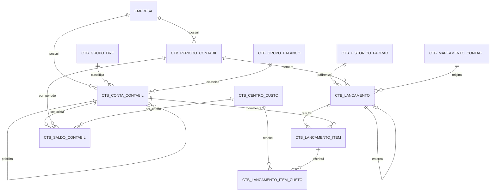
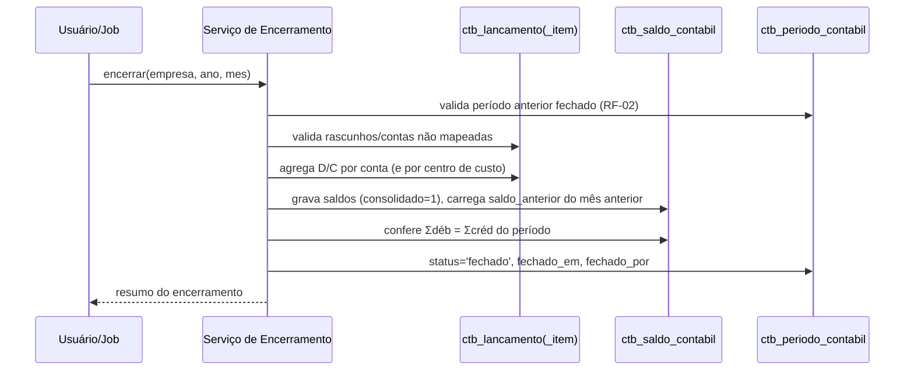

# DATABASE_MODEL.md — Modelo de Dados do Módulo Contábil (MySQL)

## 1. Objetivo

Especificar o schema MySQL completo do módulo contábil: tabelas, campos, tipos, índices, FKs, regras de integridade, DER, DDL, particionamento e estratégia de performance para 10M+ lançamentos com relatórios instantâneos.

## 2. Responsabilidades

- Fonte única de verdade do schema (qualquer migração deriva deste documento).
- Garantir multi-tenant (`empresa_id` em tudo), auditoria (`created_at`/`updated_at`) e preparação SPED.

## 3. Convenções

- Engine **InnoDB**, charset `utf8mb4`, collation `utf8mb4_unicode_ci`.
- Prefixo `ctb_` em todas as tabelas do módulo.
- PKs `BIGINT UNSIGNED AUTO_INCREMENT`. Monetários `DECIMAL(15,2)`. Datas de negócio `DATE`; timestamps `DATETIME` com `DEFAULT CURRENT_TIMESTAMP` / `ON UPDATE CURRENT_TIMESTAMP`.
- Unicidade lógica sempre composta com `empresa_id`.
- `empresa_id` referencia a tabela de empresas existente do SaaS (`empresas.id` — ajustar nome na migração conforme schema real).

## 4. Visão Geral — DER



## 5. Tabelas

### 5.1 `ctb_conta_contabil` — Plano de Contas

**Objetivo:** árvore hierárquica de contas por empresa, base de todo o módulo (ECD I050).

| Campo | Tipo | Regras |
|---|---|---|
| id | BIGINT UNSIGNED PK AI | |
| empresa_id | BIGINT UNSIGNED NOT NULL | FK empresas |
| codigo | VARCHAR(20) NOT NULL | máscara `9.9.99.999.9999`; UNIQUE com empresa |
| nome | VARCHAR(150) NOT NULL | |
| conta_pai_id | BIGINT UNSIGNED NULL | FK self; NULL = raiz |
| nivel | TINYINT UNSIGNED NOT NULL | derivado do código (1..5) |
| tipo | ENUM('ativo','passivo','patrimonio_liquido','receita','custo','despesa','apuracao') NOT NULL | |
| natureza | ENUM('devedora','credora') NOT NULL | |
| aceita_lancamento | TINYINT(1) NOT NULL DEFAULT 0 | 1 = analítica |
| grupo_dre_id | BIGINT UNSIGNED NULL | FK ctb_grupo_dre; obrigatória p/ analítica de resultado |
| grupo_balanco_id | BIGINT UNSIGNED NULL | FK ctb_grupo_balanco; obrigatória p/ analítica patrimonial |
| codigo_referencial | VARCHAR(20) NULL | plano referencial RFB (ECD I051, fase SPED) |
| ativo | TINYINT(1) NOT NULL DEFAULT 1 | |
| created_at / updated_at | DATETIME NOT NULL | |

Índices: `UNIQUE uq_conta (empresa_id, codigo)`; `idx_conta_pai (conta_pai_id)`; `idx_conta_tipo (empresa_id, tipo, ativo)`.
Integridade: RP-01..RP-07 de `BUSINESS_RULES.md` (validadas na aplicação; FK self com `ON DELETE RESTRICT`).

### 5.2 `ctb_grupo_dre` — Estrutura da DRE

**Objetivo:** linhas da DRE por empresa, com ordem e operação.

| Campo | Tipo | Regras |
|---|---|---|
| id, empresa_id, created_at, updated_at | padrão | |
| codigo | VARCHAR(10) NOT NULL | UNIQUE com empresa |
| descricao | VARCHAR(120) NOT NULL | ex.: "(-) Deduções da Receita" |
| ordem | SMALLINT UNSIGNED NOT NULL | ordenação de exibição |
| tipo_operacao | ENUM('soma','subtracao','subtotal') NOT NULL | subtotal = linha calculada |
| grupo_pai_id | BIGINT UNSIGNED NULL | FK self (hierarquia opcional) |
| ativo | TINYINT(1) NOT NULL DEFAULT 1 | |

Índices: `UNIQUE uq_dre (empresa_id, codigo)`; `idx_dre_ordem (empresa_id, ordem)`.

### 5.3 `ctb_grupo_balanco` — Estrutura do Balanço

**Objetivo:** grupos do BP (lado ativo/passivo+PL), ordem e hierarquia.

| Campo | Tipo | Regras |
|---|---|---|
| id, empresa_id, created_at, updated_at | padrão | |
| codigo | VARCHAR(10) NOT NULL | UNIQUE com empresa |
| descricao | VARCHAR(120) NOT NULL | |
| lado | ENUM('ativo','passivo') NOT NULL | PL entra em 'passivo' |
| ordem | SMALLINT UNSIGNED NOT NULL | |
| grupo_pai_id | BIGINT UNSIGNED NULL | FK self |
| ativo | TINYINT(1) NOT NULL DEFAULT 1 | |

Índices: `UNIQUE uq_bal (empresa_id, codigo)`; `idx_bal_ordem (empresa_id, lado, ordem)`.

### 5.4 `ctb_historico_padrao` — Históricos Padronizados

| Campo | Tipo | Regras |
|---|---|---|
| id, empresa_id, created_at, updated_at | padrão | |
| codigo | VARCHAR(10) NOT NULL | UNIQUE com empresa |
| descricao | VARCHAR(255) NOT NULL | suporta placeholders `{documento}`, `{sacado}`, `{valor}`, `{parcela}`, `{data}` |
| exige_complemento | TINYINT(1) NOT NULL DEFAULT 0 | |
| ativo | TINYINT(1) NOT NULL DEFAULT 1 | |

Índices: `UNIQUE uq_hist (empresa_id, codigo)`.

### 5.5 `ctb_centro_custo` — Centros de Custos

| Campo | Tipo | Regras |
|---|---|---|
| id, empresa_id, created_at, updated_at | padrão | |
| codigo | VARCHAR(20) NOT NULL | UNIQUE com empresa; hierárquico (ex.: `01.02`) |
| nome | VARCHAR(120) NOT NULL | |
| centro_pai_id | BIGINT UNSIGNED NULL | FK self |
| aceita_lancamento | TINYINT(1) NOT NULL DEFAULT 1 | sintético = 0 |
| ativo | TINYINT(1) NOT NULL DEFAULT 1 | |

Índices: `UNIQUE uq_cc (empresa_id, codigo)`; `idx_cc_pai (centro_pai_id)`.

### 5.6 `ctb_periodo_contabil` — Períodos (competência)

| Campo | Tipo | Regras |
|---|---|---|
| id, empresa_id, created_at, updated_at | padrão | |
| ano | SMALLINT UNSIGNED NOT NULL | |
| mes | TINYINT UNSIGNED NOT NULL | 1..12 |
| status | ENUM('aberto','fechado','bloqueado') NOT NULL DEFAULT 'aberto' | |
| fechado_em | DATETIME NULL | |
| fechado_por | BIGINT UNSIGNED NULL | FK usuários |
| reaberto_em / reaberto_por / motivo_reabertura | DATETIME NULL / BIGINT NULL / VARCHAR(255) NULL | auditoria RF-05 |

Índices: `UNIQUE uq_periodo (empresa_id, ano, mes)`.

### 5.7 `ctb_lancamento` — Cabeçalho do Lançamento

**Objetivo:** registro do fato contábil (ECD I200).

| Campo | Tipo | Regras |
|---|---|---|
| id, empresa_id, created_at, updated_at | padrão | |
| numero | BIGINT UNSIGNED NULL | sequencial por empresa/exercício, atribuído na contabilização (RL-08) |
| data_lancamento | DATE NOT NULL | data de digitação |
| data_competencia | DATE NOT NULL | usada em relatórios |
| periodo_id | BIGINT UNSIGNED NOT NULL | FK ctb_periodo_contabil (derivado da competência) |
| historico_padrao_id | BIGINT UNSIGNED NULL | FK ctb_historico_padrao |
| historico | VARCHAR(500) NOT NULL | texto final (padrão resolvido + complemento, ou livre) |
| valor_total | DECIMAL(15,2) NOT NULL | = Σ débitos (= Σ créditos) |
| status | ENUM('rascunho','contabilizado','estornado') NOT NULL DEFAULT 'rascunho' | |
| origem_tipo | ENUM('manual','financeiro','encerramento','estorno','importacao') NOT NULL DEFAULT 'manual' | |
| origem_id | BIGINT UNSIGNED NULL | id do registro de origem |
| origem_chave_idempotencia | VARCHAR(120) NULL | ex.: `boleto:123:liquidacao` |
| lancamento_estorno_id | BIGINT UNSIGNED NULL | FK self — lançamento que este estorna |
| criado_por | BIGINT UNSIGNED NULL | FK usuários |
| lote_id | BIGINT UNSIGNED NULL | agrupamento de importação/encerramento |

Índices: `UNIQUE uq_lanc_numero (empresa_id, numero)`; `UNIQUE uq_lanc_idem (empresa_id, origem_chave_idempotencia)`; `idx_lanc_comp (empresa_id, data_competencia, status)`; `idx_lanc_periodo (periodo_id)`; `idx_lanc_origem (empresa_id, origem_tipo, origem_id)`.

### 5.8 `ctb_lancamento_item` — Partidas (ECD I250)

**Objetivo:** itens D/C do lançamento. **Tabela de maior volume** — alvo do particionamento.

| Campo | Tipo | Regras |
|---|---|---|
| id | BIGINT UNSIGNED NOT NULL AI | PK composta com data_competencia (partição) |
| empresa_id | BIGINT UNSIGNED NOT NULL | redundante propositalmente (evita JOIN em relatório) |
| lancamento_id | BIGINT UNSIGNED NOT NULL | FK lógica ctb_lancamento |
| conta_id | BIGINT UNSIGNED NOT NULL | FK lógica ctb_conta_contabil (analítica) |
| tipo | ENUM('D','C') NOT NULL | |
| valor | DECIMAL(15,2) NOT NULL | > 0 |
| data_competencia | DATE NOT NULL | desnormalizada do cabeçalho — chave de partição |
| historico_item | VARCHAR(255) NULL | complemento por partida (opcional) |
| created_at / updated_at | DATETIME NOT NULL | |

Índices: `PRIMARY KEY (id, data_competencia)`; `idx_item_conta (empresa_id, conta_id, data_competencia)`; `idx_item_lanc (lancamento_id)`.
Nota: com particionamento MySQL, FKs físicas não são suportadas na tabela particionada — integridade de `lancamento_id`/`conta_id` garantida pela aplicação + verificação batch (ver §8.4).

### 5.9 `ctb_lancamento_item_custo` — Distribuição por Centro de Custo

**Objetivo:** ratear um item entre N centros de custo (soma = valor do item, RL-12).

| Campo | Tipo | Regras |
|---|---|---|
| id, empresa_id, created_at, updated_at | padrão | |
| lancamento_item_id | BIGINT UNSIGNED NOT NULL | FK lógica ctb_lancamento_item |
| centro_custo_id | BIGINT UNSIGNED NOT NULL | FK ctb_centro_custo (analítico) |
| valor | DECIMAL(15,2) NOT NULL | > 0 |
| percentual | DECIMAL(7,4) NULL | informativo |

Índices: `idx_lic_item (lancamento_item_id)`; `idx_lic_cc (empresa_id, centro_custo_id)`.

### 5.10 `ctb_saldo_contabil` — Saldos Consolidados (ECD I150/I155)

**Objetivo:** materialização de saldos por empresa × conta × período (× centro de custo). Chave da performance de relatórios.

| Campo | Tipo | Regras |
|---|---|---|
| id, empresa_id, created_at, updated_at | padrão | |
| conta_id | BIGINT UNSIGNED NOT NULL | FK ctb_conta_contabil |
| periodo_id | BIGINT UNSIGNED NOT NULL | FK ctb_periodo_contabil |
| centro_custo_id | BIGINT UNSIGNED NULL | NULL = consolidado geral da conta |
| saldo_anterior | DECIMAL(15,2) NOT NULL DEFAULT 0 | saldo bruto D−C acumulado até o período anterior |
| total_debitos | DECIMAL(15,2) NOT NULL DEFAULT 0 | |
| total_creditos | DECIMAL(15,2) NOT NULL DEFAULT 0 | |
| saldo_final | DECIMAL(15,2) NOT NULL DEFAULT 0 | anterior + D − C (bruto) |
| consolidado | TINYINT(1) NOT NULL DEFAULT 0 | 1 = período fechado (imutável) |

Índices: `UNIQUE uq_saldo (empresa_id, conta_id, periodo_id, centro_custo_id)`; `idx_saldo_periodo (empresa_id, periodo_id)`.
Nota MySQL: como `centro_custo_id` NULL não participa de UNIQUE de forma confiável, usar valor sentinela `0` para "consolidado geral" OU coluna gerada `centro_custo_key = IFNULL(centro_custo_id,0)` no UNIQUE.

### 5.11 `ctb_mapeamento_contabil` — Mapeamento Financeiro → Contábil

**Objetivo:** de-para de eventos do Financeiro para contas/histórico (ver `INTEGRATIONS.md`).

| Campo | Tipo | Regras |
|---|---|---|
| id, empresa_id, created_at, updated_at | padrão | |
| evento | VARCHAR(60) NOT NULL | ex.: `boleto.liquidado`, `duplicata.emitida` |
| conta_debito_id / conta_credito_id | BIGINT UNSIGNED NOT NULL | FKs ctb_conta_contabil |
| historico_padrao_id | BIGINT UNSIGNED NULL | |
| centro_custo_id | BIGINT UNSIGNED NULL | default opcional |
| condicao_json | JSON NULL | filtros (ex.: por conta bancária, carteira) |
| versao | SMALLINT UNSIGNED NOT NULL DEFAULT 1 | mapeamento versionado |
| ativo | TINYINT(1) NOT NULL DEFAULT 1 | |

Índices: `idx_map_evento (empresa_id, evento, ativo)`.

### 5.12 `ctb_integracao_pendencia` — Fila de pendências de integração

| Campo | Tipo | Regras |
|---|---|---|
| id, empresa_id, created_at, updated_at | padrão | |
| evento | VARCHAR(60) NOT NULL | |
| origem_tipo / origem_id | VARCHAR(40) / BIGINT UNSIGNED | |
| payload_json | JSON NOT NULL | snapshot do evento |
| status | ENUM('pendente','processado','erro','descartado') NOT NULL DEFAULT 'pendente' | |
| erro_msg | VARCHAR(500) NULL | |
| tentativas | TINYINT UNSIGNED NOT NULL DEFAULT 0 | |

Índices: `idx_pend_status (empresa_id, status)`; `UNIQUE uq_pend (empresa_id, origem_tipo, origem_id, evento)`.

## 6. DDL MySQL (scripts)

```sql
-- 001_create_ctb_tables.sql  (idempotente)
SET NAMES utf8mb4;

CREATE TABLE IF NOT EXISTS ctb_grupo_dre (
  id BIGINT UNSIGNED NOT NULL AUTO_INCREMENT,
  empresa_id BIGINT UNSIGNED NOT NULL,
  codigo VARCHAR(10) NOT NULL,
  descricao VARCHAR(120) NOT NULL,
  ordem SMALLINT UNSIGNED NOT NULL,
  tipo_operacao ENUM('soma','subtracao','subtotal') NOT NULL,
  grupo_pai_id BIGINT UNSIGNED NULL,
  ativo TINYINT(1) NOT NULL DEFAULT 1,
  created_at DATETIME NOT NULL DEFAULT CURRENT_TIMESTAMP,
  updated_at DATETIME NOT NULL DEFAULT CURRENT_TIMESTAMP ON UPDATE CURRENT_TIMESTAMP,
  PRIMARY KEY (id),
  UNIQUE KEY uq_dre (empresa_id, codigo),
  KEY idx_dre_ordem (empresa_id, ordem),
  CONSTRAINT fk_dre_pai FOREIGN KEY (grupo_pai_id) REFERENCES ctb_grupo_dre(id) ON DELETE RESTRICT
) ENGINE=InnoDB DEFAULT CHARSET=utf8mb4 COLLATE=utf8mb4_unicode_ci;

CREATE TABLE IF NOT EXISTS ctb_grupo_balanco (
  id BIGINT UNSIGNED NOT NULL AUTO_INCREMENT,
  empresa_id BIGINT UNSIGNED NOT NULL,
  codigo VARCHAR(10) NOT NULL,
  descricao VARCHAR(120) NOT NULL,
  lado ENUM('ativo','passivo') NOT NULL,
  ordem SMALLINT UNSIGNED NOT NULL,
  grupo_pai_id BIGINT UNSIGNED NULL,
  ativo TINYINT(1) NOT NULL DEFAULT 1,
  created_at DATETIME NOT NULL DEFAULT CURRENT_TIMESTAMP,
  updated_at DATETIME NOT NULL DEFAULT CURRENT_TIMESTAMP ON UPDATE CURRENT_TIMESTAMP,
  PRIMARY KEY (id),
  UNIQUE KEY uq_bal (empresa_id, codigo),
  KEY idx_bal_ordem (empresa_id, lado, ordem),
  CONSTRAINT fk_bal_pai FOREIGN KEY (grupo_pai_id) REFERENCES ctb_grupo_balanco(id) ON DELETE RESTRICT
) ENGINE=InnoDB DEFAULT CHARSET=utf8mb4 COLLATE=utf8mb4_unicode_ci;

CREATE TABLE IF NOT EXISTS ctb_conta_contabil (
  id BIGINT UNSIGNED NOT NULL AUTO_INCREMENT,
  empresa_id BIGINT UNSIGNED NOT NULL,
  codigo VARCHAR(20) NOT NULL,
  nome VARCHAR(150) NOT NULL,
  conta_pai_id BIGINT UNSIGNED NULL,
  nivel TINYINT UNSIGNED NOT NULL,
  tipo ENUM('ativo','passivo','patrimonio_liquido','receita','custo','despesa','apuracao') NOT NULL,
  natureza ENUM('devedora','credora') NOT NULL,
  aceita_lancamento TINYINT(1) NOT NULL DEFAULT 0,
  grupo_dre_id BIGINT UNSIGNED NULL,
  grupo_balanco_id BIGINT UNSIGNED NULL,
  codigo_referencial VARCHAR(20) NULL,
  ativo TINYINT(1) NOT NULL DEFAULT 1,
  created_at DATETIME NOT NULL DEFAULT CURRENT_TIMESTAMP,
  updated_at DATETIME NOT NULL DEFAULT CURRENT_TIMESTAMP ON UPDATE CURRENT_TIMESTAMP,
  PRIMARY KEY (id),
  UNIQUE KEY uq_conta (empresa_id, codigo),
  KEY idx_conta_pai (conta_pai_id),
  KEY idx_conta_tipo (empresa_id, tipo, ativo),
  CONSTRAINT fk_conta_pai FOREIGN KEY (conta_pai_id) REFERENCES ctb_conta_contabil(id) ON DELETE RESTRICT,
  CONSTRAINT fk_conta_dre FOREIGN KEY (grupo_dre_id) REFERENCES ctb_grupo_dre(id) ON DELETE RESTRICT,
  CONSTRAINT fk_conta_bal FOREIGN KEY (grupo_balanco_id) REFERENCES ctb_grupo_balanco(id) ON DELETE RESTRICT
) ENGINE=InnoDB DEFAULT CHARSET=utf8mb4 COLLATE=utf8mb4_unicode_ci;

CREATE TABLE IF NOT EXISTS ctb_historico_padrao (
  id BIGINT UNSIGNED NOT NULL AUTO_INCREMENT,
  empresa_id BIGINT UNSIGNED NOT NULL,
  codigo VARCHAR(10) NOT NULL,
  descricao VARCHAR(255) NOT NULL,
  exige_complemento TINYINT(1) NOT NULL DEFAULT 0,
  ativo TINYINT(1) NOT NULL DEFAULT 1,
  created_at DATETIME NOT NULL DEFAULT CURRENT_TIMESTAMP,
  updated_at DATETIME NOT NULL DEFAULT CURRENT_TIMESTAMP ON UPDATE CURRENT_TIMESTAMP,
  PRIMARY KEY (id),
  UNIQUE KEY uq_hist (empresa_id, codigo)
) ENGINE=InnoDB DEFAULT CHARSET=utf8mb4 COLLATE=utf8mb4_unicode_ci;

CREATE TABLE IF NOT EXISTS ctb_centro_custo (
  id BIGINT UNSIGNED NOT NULL AUTO_INCREMENT,
  empresa_id BIGINT UNSIGNED NOT NULL,
  codigo VARCHAR(20) NOT NULL,
  nome VARCHAR(120) NOT NULL,
  centro_pai_id BIGINT UNSIGNED NULL,
  aceita_lancamento TINYINT(1) NOT NULL DEFAULT 1,
  ativo TINYINT(1) NOT NULL DEFAULT 1,
  created_at DATETIME NOT NULL DEFAULT CURRENT_TIMESTAMP,
  updated_at DATETIME NOT NULL DEFAULT CURRENT_TIMESTAMP ON UPDATE CURRENT_TIMESTAMP,
  PRIMARY KEY (id),
  UNIQUE KEY uq_cc (empresa_id, codigo),
  KEY idx_cc_pai (centro_pai_id),
  CONSTRAINT fk_cc_pai FOREIGN KEY (centro_pai_id) REFERENCES ctb_centro_custo(id) ON DELETE RESTRICT
) ENGINE=InnoDB DEFAULT CHARSET=utf8mb4 COLLATE=utf8mb4_unicode_ci;

CREATE TABLE IF NOT EXISTS ctb_periodo_contabil (
  id BIGINT UNSIGNED NOT NULL AUTO_INCREMENT,
  empresa_id BIGINT UNSIGNED NOT NULL,
  ano SMALLINT UNSIGNED NOT NULL,
  mes TINYINT UNSIGNED NOT NULL,
  status ENUM('aberto','fechado','bloqueado') NOT NULL DEFAULT 'aberto',
  fechado_em DATETIME NULL,
  fechado_por BIGINT UNSIGNED NULL,
  reaberto_em DATETIME NULL,
  reaberto_por BIGINT UNSIGNED NULL,
  motivo_reabertura VARCHAR(255) NULL,
  created_at DATETIME NOT NULL DEFAULT CURRENT_TIMESTAMP,
  updated_at DATETIME NOT NULL DEFAULT CURRENT_TIMESTAMP ON UPDATE CURRENT_TIMESTAMP,
  PRIMARY KEY (id),
  UNIQUE KEY uq_periodo (empresa_id, ano, mes),
  CONSTRAINT chk_mes CHECK (mes BETWEEN 1 AND 12)
) ENGINE=InnoDB DEFAULT CHARSET=utf8mb4 COLLATE=utf8mb4_unicode_ci;

CREATE TABLE IF NOT EXISTS ctb_lancamento (
  id BIGINT UNSIGNED NOT NULL AUTO_INCREMENT,
  empresa_id BIGINT UNSIGNED NOT NULL,
  numero BIGINT UNSIGNED NULL,
  data_lancamento DATE NOT NULL,
  data_competencia DATE NOT NULL,
  periodo_id BIGINT UNSIGNED NOT NULL,
  historico_padrao_id BIGINT UNSIGNED NULL,
  historico VARCHAR(500) NOT NULL,
  valor_total DECIMAL(15,2) NOT NULL,
  status ENUM('rascunho','contabilizado','estornado') NOT NULL DEFAULT 'rascunho',
  origem_tipo ENUM('manual','financeiro','encerramento','estorno','importacao') NOT NULL DEFAULT 'manual',
  origem_id BIGINT UNSIGNED NULL,
  origem_chave_idempotencia VARCHAR(120) NULL,
  lancamento_estorno_id BIGINT UNSIGNED NULL,
  criado_por BIGINT UNSIGNED NULL,
  lote_id BIGINT UNSIGNED NULL,
  created_at DATETIME NOT NULL DEFAULT CURRENT_TIMESTAMP,
  updated_at DATETIME NOT NULL DEFAULT CURRENT_TIMESTAMP ON UPDATE CURRENT_TIMESTAMP,
  PRIMARY KEY (id),
  UNIQUE KEY uq_lanc_numero (empresa_id, numero),
  UNIQUE KEY uq_lanc_idem (empresa_id, origem_chave_idempotencia),
  KEY idx_lanc_comp (empresa_id, data_competencia, status),
  KEY idx_lanc_periodo (periodo_id),
  KEY idx_lanc_origem (empresa_id, origem_tipo, origem_id),
  CONSTRAINT fk_lanc_periodo FOREIGN KEY (periodo_id) REFERENCES ctb_periodo_contabil(id) ON DELETE RESTRICT,
  CONSTRAINT fk_lanc_hist FOREIGN KEY (historico_padrao_id) REFERENCES ctb_historico_padrao(id) ON DELETE RESTRICT,
  CONSTRAINT fk_lanc_estorno FOREIGN KEY (lancamento_estorno_id) REFERENCES ctb_lancamento(id) ON DELETE RESTRICT
) ENGINE=InnoDB DEFAULT CHARSET=utf8mb4 COLLATE=utf8mb4_unicode_ci;

-- Tabela de maior volume: particionada por RANGE na competência (sem FKs físicas)
CREATE TABLE IF NOT EXISTS ctb_lancamento_item (
  id BIGINT UNSIGNED NOT NULL AUTO_INCREMENT,
  empresa_id BIGINT UNSIGNED NOT NULL,
  lancamento_id BIGINT UNSIGNED NOT NULL,
  conta_id BIGINT UNSIGNED NOT NULL,
  tipo ENUM('D','C') NOT NULL,
  valor DECIMAL(15,2) NOT NULL,
  data_competencia DATE NOT NULL,
  historico_item VARCHAR(255) NULL,
  created_at DATETIME NOT NULL DEFAULT CURRENT_TIMESTAMP,
  updated_at DATETIME NOT NULL DEFAULT CURRENT_TIMESTAMP ON UPDATE CURRENT_TIMESTAMP,
  PRIMARY KEY (id, data_competencia),
  KEY idx_item_conta (empresa_id, conta_id, data_competencia),
  KEY idx_item_lanc (lancamento_id),
  CONSTRAINT chk_valor_pos CHECK (valor > 0)
) ENGINE=InnoDB DEFAULT CHARSET=utf8mb4 COLLATE=utf8mb4_unicode_ci
PARTITION BY RANGE (TO_DAYS(data_competencia)) (
  PARTITION p2025 VALUES LESS THAN (TO_DAYS('2026-01-01')),
  PARTITION p2026 VALUES LESS THAN (TO_DAYS('2027-01-01')),
  PARTITION p2027 VALUES LESS THAN (TO_DAYS('2028-01-01')),
  PARTITION pmax  VALUES LESS THAN MAXVALUE
);

CREATE TABLE IF NOT EXISTS ctb_lancamento_item_custo (
  id BIGINT UNSIGNED NOT NULL AUTO_INCREMENT,
  empresa_id BIGINT UNSIGNED NOT NULL,
  lancamento_item_id BIGINT UNSIGNED NOT NULL,
  centro_custo_id BIGINT UNSIGNED NOT NULL,
  valor DECIMAL(15,2) NOT NULL,
  percentual DECIMAL(7,4) NULL,
  created_at DATETIME NOT NULL DEFAULT CURRENT_TIMESTAMP,
  updated_at DATETIME NOT NULL DEFAULT CURRENT_TIMESTAMP ON UPDATE CURRENT_TIMESTAMP,
  PRIMARY KEY (id),
  KEY idx_lic_item (lancamento_item_id),
  KEY idx_lic_cc (empresa_id, centro_custo_id),
  CONSTRAINT fk_lic_cc FOREIGN KEY (centro_custo_id) REFERENCES ctb_centro_custo(id) ON DELETE RESTRICT
) ENGINE=InnoDB DEFAULT CHARSET=utf8mb4 COLLATE=utf8mb4_unicode_ci;

CREATE TABLE IF NOT EXISTS ctb_saldo_contabil (
  id BIGINT UNSIGNED NOT NULL AUTO_INCREMENT,
  empresa_id BIGINT UNSIGNED NOT NULL,
  conta_id BIGINT UNSIGNED NOT NULL,
  periodo_id BIGINT UNSIGNED NOT NULL,
  centro_custo_id BIGINT UNSIGNED NULL,
  centro_custo_key BIGINT UNSIGNED AS (IFNULL(centro_custo_id, 0)) STORED,
  saldo_anterior DECIMAL(15,2) NOT NULL DEFAULT 0,
  total_debitos DECIMAL(15,2) NOT NULL DEFAULT 0,
  total_creditos DECIMAL(15,2) NOT NULL DEFAULT 0,
  saldo_final DECIMAL(15,2) NOT NULL DEFAULT 0,
  consolidado TINYINT(1) NOT NULL DEFAULT 0,
  created_at DATETIME NOT NULL DEFAULT CURRENT_TIMESTAMP,
  updated_at DATETIME NOT NULL DEFAULT CURRENT_TIMESTAMP ON UPDATE CURRENT_TIMESTAMP,
  PRIMARY KEY (id),
  UNIQUE KEY uq_saldo (empresa_id, conta_id, periodo_id, centro_custo_key),
  KEY idx_saldo_periodo (empresa_id, periodo_id),
  CONSTRAINT fk_saldo_conta FOREIGN KEY (conta_id) REFERENCES ctb_conta_contabil(id) ON DELETE RESTRICT,
  CONSTRAINT fk_saldo_periodo FOREIGN KEY (periodo_id) REFERENCES ctb_periodo_contabil(id) ON DELETE RESTRICT
) ENGINE=InnoDB DEFAULT CHARSET=utf8mb4 COLLATE=utf8mb4_unicode_ci;

CREATE TABLE IF NOT EXISTS ctb_mapeamento_contabil (
  id BIGINT UNSIGNED NOT NULL AUTO_INCREMENT,
  empresa_id BIGINT UNSIGNED NOT NULL,
  evento VARCHAR(60) NOT NULL,
  conta_debito_id BIGINT UNSIGNED NOT NULL,
  conta_credito_id BIGINT UNSIGNED NOT NULL,
  historico_padrao_id BIGINT UNSIGNED NULL,
  centro_custo_id BIGINT UNSIGNED NULL,
  condicao_json JSON NULL,
  versao SMALLINT UNSIGNED NOT NULL DEFAULT 1,
  ativo TINYINT(1) NOT NULL DEFAULT 1,
  created_at DATETIME NOT NULL DEFAULT CURRENT_TIMESTAMP,
  updated_at DATETIME NOT NULL DEFAULT CURRENT_TIMESTAMP ON UPDATE CURRENT_TIMESTAMP,
  PRIMARY KEY (id),
  KEY idx_map_evento (empresa_id, evento, ativo),
  CONSTRAINT fk_map_deb FOREIGN KEY (conta_debito_id) REFERENCES ctb_conta_contabil(id),
  CONSTRAINT fk_map_cred FOREIGN KEY (conta_credito_id) REFERENCES ctb_conta_contabil(id)
) ENGINE=InnoDB DEFAULT CHARSET=utf8mb4 COLLATE=utf8mb4_unicode_ci;

CREATE TABLE IF NOT EXISTS ctb_integracao_pendencia (
  id BIGINT UNSIGNED NOT NULL AUTO_INCREMENT,
  empresa_id BIGINT UNSIGNED NOT NULL,
  evento VARCHAR(60) NOT NULL,
  origem_tipo VARCHAR(40) NOT NULL,
  origem_id BIGINT UNSIGNED NOT NULL,
  payload_json JSON NOT NULL,
  status ENUM('pendente','processado','erro','descartado') NOT NULL DEFAULT 'pendente',
  erro_msg VARCHAR(500) NULL,
  tentativas TINYINT UNSIGNED NOT NULL DEFAULT 0,
  created_at DATETIME NOT NULL DEFAULT CURRENT_TIMESTAMP,
  updated_at DATETIME NOT NULL DEFAULT CURRENT_TIMESTAMP ON UPDATE CURRENT_TIMESTAMP,
  PRIMARY KEY (id),
  UNIQUE KEY uq_pend (empresa_id, origem_tipo, origem_id, evento),
  KEY idx_pend_status (empresa_id, status)
) ENGINE=InnoDB DEFAULT CHARSET=utf8mb4 COLLATE=utf8mb4_unicode_ci;
```

## 7. Particionamento

| Tabela | Estratégia | Justificativa |
|---|---|---|
| `ctb_lancamento_item` | `RANGE (TO_DAYS(data_competencia))` anual; migrar para mensal se > 50M linhas/ano | Relatórios sempre filtram por competência → partition pruning elimina 90%+ do scan |
| `ctb_lancamento` | Sem partição até ~20M; depois RANGE anual por `data_competencia` | Cabeçalho é ~⅓ do volume dos itens |
| `ctb_saldo_contabil` | Sem partição | Volume baixo (contas × períodos × empresas) |

Manutenção: job anual cria a partição do próximo exercício (`ALTER TABLE ... REORGANIZE PARTITION pmax INTO (...)`). Nunca usar `DROP PARTITION` (dados contábeis são permanentes — guarda fiscal mínima de 5 anos, manter tudo).

## 8. Estratégia de Performance (10M+ lançamentos)

### 8.1 Saldos materializados (decisão central)

Nenhum relatório soma `ctb_lancamento_item` desde o início dos tempos. Fórmula universal:

```
saldo(conta, até período P) = ctb_saldo_contabil.saldo_final do último período FECHADO ≤ P
                            + Σ itens do trecho ABERTO (delta, via idx_item_conta)
```

Períodos fechados ⇒ leitura O(contas) na tabela de saldos. Apenas o mês corrente exige agregação de itens, limitada pela partição + índice `(empresa_id, conta_id, data_competencia)`.

### 8.2 Atualização incremental

Na contabilização/estorno, dentro da mesma transação:

```sql
INSERT INTO ctb_saldo_contabil (empresa_id, conta_id, periodo_id, centro_custo_id, total_debitos, total_creditos, saldo_final)
VALUES (?, ?, ?, NULL, ?, ?, ? )
ON DUPLICATE KEY UPDATE
  total_debitos = total_debitos + VALUES(total_debitos),
  total_creditos = total_creditos + VALUES(total_creditos),
  saldo_final = saldo_final + VALUES(total_debitos) - VALUES(total_creditos);
```

Job noturno de **reconciliação** recalcula o período aberto a partir dos itens e alerta divergências (defesa contra bugs).

### 8.3 Índices orientados a consulta

| Consulta | Índice usado |
|---|---|
| Razão de uma conta no período | `idx_item_conta (empresa_id, conta_id, data_competencia)` + pruning |
| Diário do período | `idx_lanc_comp (empresa_id, data_competencia, status)` |
| Balancete/DRE/BP | `uq_saldo` / `idx_saldo_periodo` (só tabela de saldos) |
| Itens de um lançamento | `idx_item_lanc (lancamento_id)` |
| Rastreio de origem | `idx_lanc_origem` |

### 8.4 Demais técnicas

- `empresa_id` e `data_competencia` desnormalizados em `ctb_lancamento_item` eliminam JOIN no caminho quente.
- FKs físicas omitidas na tabela particionada; job batch semanal valida órfãos (`LEFT JOIN ... IS NULL`).
- Escrita em lote (integração/importação): `INSERT` multi-row, transação por lote de 500.
- Sequência de `numero` por empresa via tabela `ctb_sequencia` (`SELECT ... FOR UPDATE`) — evita gap e race condition.
- Paginação por *keyset* (`WHERE id > ?`) em listagens grandes, nunca `OFFSET` profundo.
- Relatórios pesados exportados de forma assíncrona (job + notificação) acima de um limiar de linhas.
- Réplica de leitura MySQL para relatórios quando disponível.

### 8.5 Relatórios instantâneos — resumo

1. Balancete/DRE/BP de períodos fechados: leitura pura de `ctb_saldo_contabil` (milissegundos).
2. Período corrente: saldos fechados + delta particionado.
3. Cache de aplicação (TTL curto) por `empresa+relatório+filtros` invalidado por evento de contabilização.

## 9. Fluxo de consolidação (encerramento)



## 10. Validações de Integridade (resumo)

1. Aplicação valida tudo de `BUSINESS_RULES.md` antes de persistir.
2. Banco garante: unicidades compostas, FKs (exceto tabela particionada), `CHECK valor > 0`, ENUMs.
3. Jobs batch: órfãos da tabela particionada, reconciliação de saldos, lacunas de numeração.

## 11. Exemplos

Lançamento de liquidação de boleto (R$ 1.050,00 com R$ 10,00 de tarifa):

```sql
-- cabeçalho
INSERT INTO ctb_lancamento (empresa_id, numero, data_lancamento, data_competencia, periodo_id,
  historico, valor_total, status, origem_tipo, origem_id, origem_chave_idempotencia)
VALUES (1, 4502, '2026-06-04', '2026-06-04', 78,
  'Liquidação do boleto 000123 - Cliente X', 1050.00, 'contabilizado', 'financeiro', 123, 'boleto:123:liquidacao');

-- itens (Σ D = Σ C = 1.050,00)
INSERT INTO ctb_lancamento_item (empresa_id, lancamento_id, conta_id, tipo, valor, data_competencia) VALUES
(1, @lanc, 101, 'D', 1040.00, '2026-06-04'),  -- Banco
(1, @lanc, 610, 'D',   10.00, '2026-06-04'),  -- Despesa tarifa
(1, @lanc, 112, 'C', 1050.00, '2026-06-04');  -- Clientes
```
