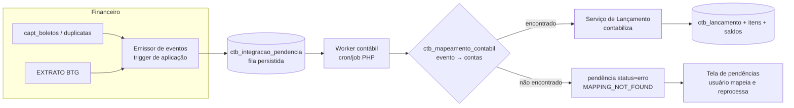

# INTEGRATIONS.md — Integração com o Financeiro e Preparação SPED

## 1. Objetivo

Especificar como o módulo contábil consome eventos do módulo Financeiro existente (boletos, duplicatas, extrato, remessas CNAB) para gerar lançamentos automáticos, e como a estrutura se prepara para o SPED Contábil (ECD).

## 2. Responsabilidades

- Definir o catálogo de eventos contabilizáveis e seu contrato.
- Garantir idempotência (RI-02), rastreabilidade e não-bloqueio do Financeiro (RI-04).
- O contábil é **somente leitor** do Financeiro (RI-05).

## 3. Arquitetura da Integração



Modelo **pull assíncrono**: o Financeiro apenas insere o evento na fila (operação barata e não bloqueante); o worker contábil processa em lote.

## 4. Catálogo de Eventos (fase 1)

| Evento | Disparo no Financeiro | Lançamento padrão (D / C) |
|---|---|---|
| `duplicata.emitida` | criação de boleto/duplicata em `capt_boletos` | D Clientes / C Receita de Vendas |
| `boleto.liquidado` | baixa por pagamento (retorno CNAB/extrato) | D Banco / C Clientes |
| `boleto.liquidado.juros` | valor pago > valor face | D Banco / C Receita de Juros (diferença) |
| `boleto.liquidado.desconto` | valor pago < valor face com desconto | D Desconto Concedido / C Clientes (diferença) |
| `boleto.cancelado` | cancelamento/baixa sem pagamento | estorno do `duplicata.emitida` |
| `tarifa.cobrada` | tarifa bancária identificada no extrato | D Despesa Bancária / C Banco |
| `extrato.credito_avulso` | crédito não conciliado classificado pelo usuário | conforme classificação manual |
| `extrato.debito_avulso` | débito não conciliado classificado pelo usuário | conforme classificação manual |

O catálogo é extensível: novos eventos exigem apenas linhas em `ctb_mapeamento_contabil` (com `condicao_json` para variações, ex.: por conta bancária/carteira).

## 5. Contrato do Evento (payload na fila)

```json
{
  "evento": "boleto.liquidado",
  "origem_tipo": "boleto",
  "origem_id": 123,
  "empresa_id": 1,
  "data_competencia": "2026-06-04",
  "valores": { "principal": "1000.00", "juros": "50.00", "tarifa": "10.00" },
  "referencias": { "documento": "000123", "sacado": "Cliente X", "conta_bancaria_id": 7 },
  "ocorrido_em": "2026-06-04T14:32:00-03:00"
}
```

Regras: `empresa_id` obrigatório; `valores` com decimal string; payload completo persistido em `payload_json` (replay possível).

## 6. Idempotência e Reprocessamento

1. Chave única `(empresa_id, origem_tipo, origem_id, evento)` na fila e `origem_chave_idempotencia = "{origem_tipo}:{origem_id}:{evento}"` no lançamento.
2. Worker reprocessável: se o lançamento já existe, marca pendência como `processado` e segue (sem erro, sem duplicação).
3. Retry com backoff: tentativas 1, 5, 15, 60 min; após 5 falhas → `status='erro'` (dead-letter) e notificação.
4. Evento de cancelamento sempre gera **estorno** vinculado, nunca apaga (RI-03).

## 7. Fluxo de Liquidação (exemplo ponta a ponta)

```mermaid
sequenceDiagram
    participant F as Financeiro (retorno CNAB)
    participant Q as Fila ctb_integracao_pendencia
    participant W as Worker
    participant MC as Mapeamento
    participant LC as Lançamentos
    F->>Q: boleto.liquidado (id=123, principal+juros)
    W->>Q: poll lote (status=pendente)
    W->>MC: resolve evento+condições
    MC-->>W: D Banco 7 / C Clientes; juros → C Receita Juros
    W->>LC: contabilizar (transação, idempotente)
    LC-->>W: lançamento nº 4502
    W->>Q: status=processado, lancamento_id=4502
```

## 8. Tela de Pendências

Lista `ctb_integracao_pendencia` com `status IN ('pendente','erro')`: evento, origem, valor, erro, tentativas. Ações: criar/ajustar mapeamento e **reprocessar**; ou **descartar** com justificativa (auditada). Pendências não bloqueiam o Financeiro nem o encerramento de períodos *anteriores* à competência do evento.

## 9. Preparação SPED Contábil (ECD) — fase futura

O módulo não gera o arquivo ECD na fase 1, mas o modelo já garante os pré-requisitos:

| Registro ECD | Pré-requisito já atendido |
|---|---|
| 0000/0007 | dados da empresa (tabela `empresas` do SaaS) |
| I050 (plano de contas) | `ctb_conta_contabil` com natureza, S/A (`aceita_lancamento`), datas |
| I051 (referencial RFB) | coluna `codigo_referencial` (preencher na fase SPED) |
| I100/I150/I155 (saldos) | `ctb_saldo_contabil` mensal consolidado |
| I200/I250 (lançamentos) | numeração sequencial sem lacunas, data, valor, itens D/C, histórico |
| I350/I355 (apuração) | encerramento de resultado via ARE |
| J100/J150 (BP/DRE) | `ctb_grupo_balanco` / `ctb_grupo_dre` |

Tarefas da fase SPED: exportador TXT no leiaute vigente, mapeamento I051, assinatura digital, validação no PVA. (Ver `ROADMAP.md` fase 5.)

## 10. Integração com Supabase

O SaaS usa Supabase em partes do produto (storage, edge functions, RLS). Diretrizes:

- A contabilidade reside no **MySQL** (transações ACID e volume). Supabase é usado para: storage de PDFs de relatórios exportados (bucket `contabilidade-relatorios`), edge functions utilitárias e notificação em tempo real de conclusão de jobs (canal `ctb_jobs:{empresa_id}`).
- Qualquer espelhamento de dados contábeis para Supabase (ex.: dashboards) deve aplicar RLS por `empresa_id` equivalente às regras MySQL.

## 11. Validações

1. Evento sem `empresa_id` ou sem `data_competencia` → rejeitado na inserção da fila.
2. Competência em período fechado → lançamento gerado na competência aberta corrente com histórico "ref. competência MM/AAAA" (política configurável: `lancar_corrente` | `rejeitar`).
3. Soma dos valores do payload deve bater com o valor total contabilizado.
4. Mapeamento inativo ou conta inativa → pendência `erro`.

## 12. Exemplos

Mapeamento com condição por conta bancária:

```json
{
  "evento": "boleto.liquidado",
  "conta_debito": "1.1.1.002.0001 (Banco BTG)",
  "conta_credito": "1.1.2.001.0001 (Clientes Nacionais)",
  "historico_padrao": "001 — Recebimento da duplicata {documento} de {sacado}",
  "condicao_json": { "conta_bancaria_id": 7 }
}
```
