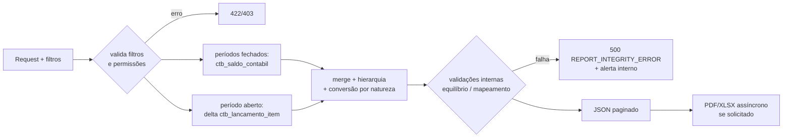

# REPORTS.md — Relatórios Contábeis

## 1. Objetivo

Especificar todos os relatórios do módulo: Livro Diário, Livro Razão, Balancete de Verificação, DRE, Balanço Patrimonial e relatórios por Centro de Custo — fontes de dados, filtros, layout, totalizações, validações e estratégia de geração.

## 2. Responsabilidades

- Definir contrato funcional de cada relatório (o "o quê"); SPECS individuais detalham o "como".
- Garantir RR-01..RR-05 de `BUSINESS_RULES.md` (competência, equilíbrio, mapeamentos, aviso de período aberto, ordem cronológica do Diário).

## 3. Regras Gerais (todos os relatórios)

1. Filtro obrigatório: `empresa_id` (do token) + intervalo de competência (`competencia_de`, `competencia_ate`, formato `YYYY-MM`).
2. Apenas lançamentos `contabilizado` (estornado aparece com seu estorno; rascunho nunca).
3. Fonte: `ctb_saldo_contabil` (períodos fechados) + delta de `ctb_lancamento_item` (período aberto) — ver `DATABASE_MODEL.md` §8.
4. Saída: JSON (API), com exportação PDF e XLSX.
5. Cabeçalho padrão: razão social, CNPJ, período, data/hora de emissão, página, e selo "PERÍODO NÃO ENCERRADO" quando aplicável.
6. Formatação de exibição: datas dd/mm/aaaa, valores `1.234,56` (a API entrega ISO e decimal com ponto; o front formata).

## 4. Livro Diário

| Aspecto | Definição |
|---|---|
| Conteúdo | Todos os lançamentos do período, ordem cronológica (`data_competencia`, `numero`) |
| Colunas | nº lançamento, data, conta (código+nome) por item, D/C, valor, histórico |
| Totais | Σ débitos e Σ créditos do período (devem ser iguais) |
| Validações | numeração sem lacunas no exercício; equilíbrio do total |
| SPED | base do I200/I250 |
| Endpoint | `GET /api/contabilidade/relatorios/diario` |

## 5. Livro Razão

| Aspecto | Definição |
|---|---|
| Conteúdo | Movimentação de uma conta (ou faixa de contas): saldo anterior, partidas em ordem cronológica com contrapartida resumida, saldo corrente após cada partida, saldo final |
| Filtros extras | `conta_id` ou intervalo de códigos; opcional `centro_custo_id` |
| Totais | total D, total C, saldo final (anterior + D − C, apresentado conforme natureza) |
| Validações | saldo final do Razão = saldo da mesma conta no Balancete |
| Endpoint | `GET /api/contabilidade/relatorios/razao` |

## 6. Balancete de Verificação

| Aspecto | Definição |
|---|---|
| Conteúdo | Todas as contas com movimento ou saldo: código, nome, saldo anterior, débitos, créditos, saldo final; sintéticas somam filhas; opção de nível máximo de detalhe |
| Filtros extras | `nivel` (1–5), `somente_com_movimento` (bool), `centro_custo_id` |
| Totais | Σ saldos devedores = Σ saldos credores; Σ débitos = Σ créditos (RR-02) — divergência aborta o relatório com erro interno |
| Endpoint | `GET /api/contabilidade/relatorios/balancete` |

## 7. DRE — Demonstração do Resultado

| Aspecto | Definição |
|---|---|
| Conteúdo | Linhas de `ctb_grupo_dre` em `ordem`, cada uma somando os saldos do período das contas de resultado mapeadas; linhas `subtotal` calculadas em cascata |
| Sinal | receitas apresentadas positivas; deduções/custos/despesas negativas (conversão pela natureza, `ACCOUNTING_CONCEPTS.md` §6) |
| Filtros extras | `centro_custo_id` (DRE gerencial), comparação multi-período (colunas por mês), acumulado do exercício |
| Validações | resultado líquido da DRE = variação do resultado no BP do mesmo período; contas de resultado não mapeadas ⇒ erro `UNMAPPED_ACCOUNT` listando-as |
| Endpoint | `GET /api/contabilidade/relatorios/dre` |

## 8. Balanço Patrimonial

| Aspecto | Definição |
|---|---|
| Conteúdo | Grupos de `ctb_grupo_balanco` (lado ativo / lado passivo+PL) com saldos **acumulados até** a competência final (posição, não movimento) |
| Resultado do período | saldo líquido das contas de resultado não encerradas entra como linha "Resultado do Período" no PL |
| Validações | Total Ativo = Total Passivo + PL (tolerância zero); contas patrimoniais não mapeadas ⇒ `UNMAPPED_ACCOUNT` |
| Filtros extras | data-base (`competencia_ate`), comparativo com período anterior |
| Endpoint | `GET /api/contabilidade/relatorios/balanco` |

## 9. Relatórios por Centro de Custo

| Relatório | Conteúdo |
|---|---|
| Resultado por centro de custo | mini-DRE filtrada por `centro_custo_id` (usa `ctb_lancamento_item_custo` / saldos por centro) |
| Comparativo de centros | matriz grupos DRE × centros de custo no período |
| Extrato do centro | itens distribuídos ao centro, com conta, data, valor, lançamento |

Endpoint: `GET /api/contabilidade/relatorios/centro-custo/*` (ver `API_SPECIFICATION.md`).

## 10. Fluxo de Geração (comum)



## 11. Exportação

- `?formato=json` (default) | `pdf` | `xlsx`.
- PDF/XLSX acima de 5.000 linhas: geração assíncrona — resposta `202` com `job_id`; download via `GET /api/contabilidade/exportacoes/{job_id}`.
- Layout PDF: A4 retrato (Diário/Balancete/DRE/BP), paisagem para Razão e comparativos; rodapé com hash de verificação do arquivo.

## 12. Exemplos

### Balancete (resumo de resposta)

```json
{
  "competencia_de": "2026-01", "competencia_ate": "2026-03",
  "periodo_encerrado": false,
  "linhas": [
    {"codigo": "1", "nome": "ATIVO", "nivel": 1, "natureza": "devedora",
     "saldo_anterior": "150000.00", "debitos": "80000.00", "creditos": "65000.00", "saldo_final": "165000.00"},
    {"codigo": "1.1.2.001", "nome": "Clientes", "nivel": 4, "natureza": "devedora",
     "saldo_anterior": "40000.00", "debitos": "30000.00", "creditos": "25000.00", "saldo_final": "45000.00"}
  ],
  "totais": {"debitos": "80000.00", "creditos": "80000.00",
             "saldos_devedores": "165000.00", "saldos_credores": "165000.00"}
}
```

### Validação cruzada obrigatória (QA)

`Diário.Σdébitos == Balancete.Σdébitos == Σ(Razão.totalD de todas as contas)` para o mesmo período — teste automatizado de release.
