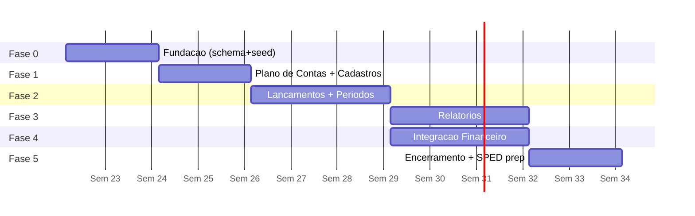

# ROADMAP.md — Fases de Implementação do Módulo Contábil

## 1. Objetivo

Sequenciar a implementação em fases incrementais, cada uma entregável e testável isoladamente, com critérios de pronto (DoD) e dependências explícitas. Datas são relativas (semanas a partir do início); o tamanho assume 1 dev backend + 1 dev frontend assistidos por IA.

## 2. Visão Geral

## 3. Fases

### Fase 0 — Fundação (2 semanas)

Escopo: migrações de todas as tabelas (`DATABASE_MODEL.md` §6), seeds (plano de contas modelo, grupos DRE/BP modelo, históricos padrão), middleware de autenticação/permissões, esqueleto de rotas, CI com testes.
DoD: migrações idempotentes aplicadas em staging; seed aplicável por empresa via endpoint; smoke test de auth multi-tenant verde.

### Fase 1 — Plano de Contas e Cadastros (2 semanas)

Escopo: CRUD + árvore de contas (`SPECS/PLAN_OF_ACCOUNTS.md`), históricos padrão, centros de custo (`SPECS/COST_CENTERS.md`), grupos DRE/Balanço com telas de mapeamento.
DoD: critérios de aprovação de endpoint (AGENTS.md §7); telas funcionais; validações RP-01..RP-07 testadas.

### Fase 2 — Lançamentos e Períodos (3 semanas)

Escopo: motor de lançamentos (`SPECS/JOURNAL_ENTRIES.md`): rascunho→contabilizado→estornado, numeração sequencial, períodos com abertura/bloqueio, atualização incremental de saldos, editor de lançamento no front com equilíbrio em tempo real, importação em lote.
DoD: teste de concorrência (100 lançamentos paralelos sem furo de número nem desequilíbrio); RL-01..RL-13 cobertas; saldos incrementais reconciliam com recálculo batch.

### Fase 3 — Relatórios (3 semanas)

Escopo: Diário, Razão, Balancete, DRE, BP, relatórios por centro de custo (`SPECS/*`); exportação PDF/XLSX síncrona e assíncrona; telas com filtros por competência.
DoD: validação cruzada Diário×Razão×Balancete automática; DRE×BP conciliados; benchmark <5s com 1M itens/período; aprovação funcional do Accounting Analyst em 3 cenários reais.

### Fase 4 — Integração com Financeiro (3 semanas, paralelizável com Fase 3)

Escopo: fila de eventos, worker, mapeamentos com condições, tela de pendências, eventos fase 1 do catálogo (`INTEGRATIONS.md` §4), estornos automáticos por cancelamento.
DoD: idempotência provada (replay de 10k eventos sem duplicar); rastreabilidade origem→lançamento na UI; dead-letter e reprocessamento funcionando.

### Fase 5 — Encerramento e Preparação SPED (2 semanas)

Escopo: encerramento mensal completo (validações + consolidação + trava), reabertura auditada, encerramento anual com zeramento via ARE, relatório de encerramento; preenchimento de `codigo_referencial` (I051) na tela de contas.
DoD: RF-01..RF-06 testadas; reabertura invalida e reconsolida períodos posteriores; exercício-teste completo (12 meses sintéticos) fecha com BP equilibrado.

### Fase 6 — SPED ECD (futura, fora do MVP)

Exportador TXT leiaute ECD vigente, validação PVA, assinatura digital, J100/J150/J800. Pré-requisitos já garantidos pelas fases 0–5.

## 4. Dependências e Riscos

| Risco | Mitigação |
|---|---|
| Volume > projeção degrada período aberto | partição mensal + benchmark contínuo na Fase 2 |
| Mapeamentos incompletos travam integração | fila de pendências não bloqueante (RI-04) desde o design |
| Reabertura de período corromper saldos | saldos posteriores marcados `consolidado=0` + reconsolidação obrigatória + auditoria |
| Divergência centavos em rateios de centro de custo | algoritmo de distribuição com ajuste do resíduo na maior parcela (`SPECS/COST_CENTERS.md` §7) |

## 5. Métricas de Sucesso do MVP

1. 100% dos lançamentos equilibrados (verificação batch diária = zero divergências).
2. Balancete de 12 meses com 1M+ itens em < 5s.
3. ≥ 95% dos eventos financeiros contabilizados automaticamente sem intervenção.
4. Zero incidentes de vazamento entre empresas.
