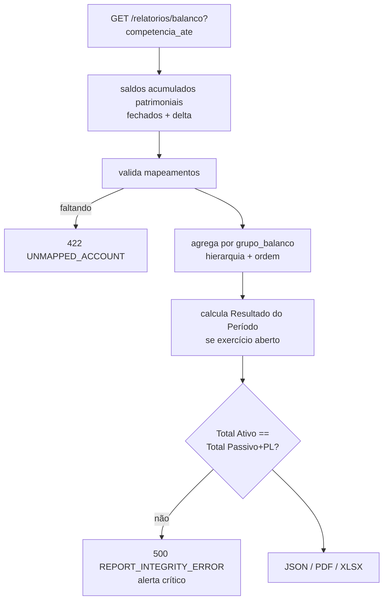

# SPECS/BALANCE_SHEET.md — Balanço Patrimonial

## 1. Objetivo

Implementar o Balanço Patrimonial (CPC 26): posição **acumulada** das contas patrimoniais na data-base, estruturada por `ctb_grupo_balanco` (Ativo × Passivo + PL), com resultado do período não encerrado incorporado ao PL e comparativo entre datas.

## 2. Responsabilidades

- Apresentar saldos acumulados desde o início da escrituração até `competencia_ate` (posição, diferente da DRE que é movimento).
- Garantir `Total Ativo = Total Passivo + PL` com tolerância **zero**.

## 3. Regras de Negócio

1. Contas `tipo IN ('ativo','passivo','patrimonio_liquido')` analíticas mapeadas a `grupo_balanco` (RP-05); não mapeada com saldo ≠ 0 → 422 `UNMAPPED_ACCOUNT`.
2. Saldo acumulado = `saldo_final` de `ctb_saldo_contabil` no último período ≤ data-base (fechado) + delta do aberto.
3. Conversão de apresentação: ativo (devedora) positivo = D−C; passivo/PL (credora) positivo = C−D. Retificadoras aparecem negativas dentro do grupo (ex.: Depreciação Acumulada).
4. **Resultado do Período**: se o exercício não foi encerrado, o líquido das contas de resultado (4−5−6, convertidas) entra como linha calculada no PL — sem lançamento. Após encerramento anual, esse valor está em Lucros/Prejuízos Acumulados e a linha zera.
5. Saldo credor de banco/caixa (estouro) é exibido **no passivo** apenas se política `reclassificar_invertidos=true`; default: permanece no ativo com flag `saldo_invertido`.
6. Comparativo: colunas para `competencia_ate` e `comparativo_com` (ex.: dezembro anterior), com variação absoluta e %.

## 4. Entidades

Leitura: `ctb_grupo_balanco`, `ctb_conta_contabil`, `ctb_saldo_contabil`, delta de `ctb_lancamento_item`.

## 5. Estrutura modelo (seed `ctb_grupo_balanco`)

| Lado | Ordem | Código | Descrição |
|---|---|---|---|
| ativo | 10 | AC | Ativo Circulante |
| ativo | 20 | ANC | Ativo Não Circulante |
| ativo | 21 | ANC.RLP | — Realizável a Longo Prazo |
| ativo | 22 | ANC.INV | — Investimentos |
| ativo | 23 | ANC.IMOB | — Imobilizado |
| ativo | 24 | ANC.INT | — Intangível |
| passivo | 10 | PC | Passivo Circulante |
| passivo | 20 | PNC | Passivo Não Circulante |
| passivo | 30 | PL | Patrimônio Líquido |
| passivo | 31 | PL.CAP | — Capital Social |
| passivo | 32 | PL.RES | — Reservas |
| passivo | 33 | PL.LPA | — Lucros/Prejuízos Acumulados |
| passivo | 34 | PL.RP | — Resultado do Período (linha calculada) |

## 6. Fluxo



## 7. Validações

1. Equação patrimonial exata (centavos) — divergência nunca é arredondada.
2. Conciliação com Balancete (mesmos saldos por conta) e com DRE (Resultado do Período).
3. Data-base em período aberto → selo RR-04.
4. Comparativo exige `comparativo_com ≤ competencia_ate`.

## 8. Exemplos

BP em 30/06/2026:

```
ATIVO                                        PASSIVO + PL
Ativo Circulante ............ 120.450,00    Passivo Circulante ..........  48.300,00
  Caixa e Bancos ..............  35.000,00    Fornecedores ................  30.000,00
  Clientes ....................  41.450,00    Obrigações Fiscais ..........  11.300,00
  (-) PECLD ...................  (2.000,00)   Obrigações Trabalhistas .....   7.000,00
  Estoques ....................  46.000,00  Passivo Não Circulante ......  25.000,00
Ativo Não Circulante ........  62.805,00    Patrimônio Líquido .......... 109.955,00
  Imobilizado .................  70.000,00    Capital Social .............  90.000,00
  (-) Depreciação Acumulada ...  (7.195,00)   Lucros Acumulados ..........  12.000,00
                                              Resultado do Período .......   7.955,00
TOTAL ATIVO ................. 183.255,00    TOTAL PASSIVO + PL .......... 183.255,00 ✓
```
