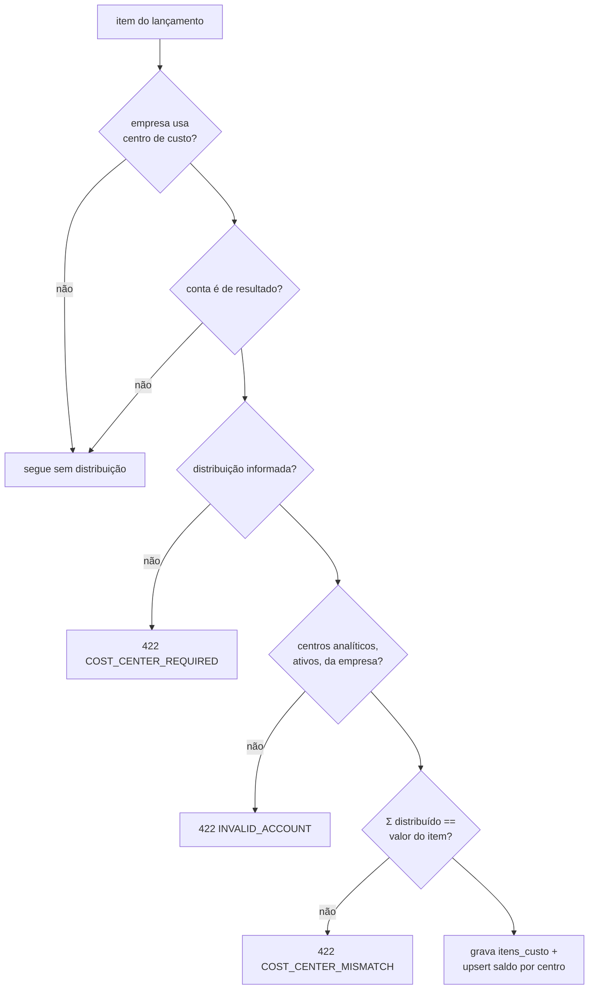

# SPECS/COST_CENTERS.md — Centros de Custos

## 1. Objetivo

Implementar a dimensão gerencial de centros de custos: cadastro hierárquico, distribuição (rateio) de itens de lançamento, saldos por centro e relatórios gerenciais — sem jamais afetar o equilíbrio contábil.

## 2. Responsabilidades

- CRUD + árvore de `ctb_centro_custo`.
- Distribuição de itens (`ctb_lancamento_item_custo`) com soma exata (RL-12).
- Saldos por centro em `ctb_saldo_contabil.centro_custo_id` e relatórios de `REPORTS.md` §9.

## 3. Regras de Negócio

1. Código hierárquico (`01`, `01.02`); centro com filhos vira sintético (`aceita_lancamento=0`) — mesmas mecânicas do plano de contas (RP-02/RP-03 adaptadas).
2. Obrigatoriedade: se `empresa.usa_centro_custo=1`, todo item de conta de **resultado** exige distribuição; itens patrimoniais é opcional (configurável `exigir_em_patrimoniais`).
3. **Soma exata**: Σ valores distribuídos == valor do item, em centavos (`COST_CENTER_MISMATCH`).
4. Rateio percentual: calcular valores arredondando para baixo e atribuir o **resíduo de centavos à maior parcela** (determinístico e auditável).
5. Centro inativo não recebe novas distribuições; histórico preservado.
6. Estorno copia a distribuição original invertida junto com os itens.
7. Exclusão física proibida com movimento (`HAS_MOVEMENTS`) — apenas inativação.

## 4. Entidades

`ctb_centro_custo`, `ctb_lancamento_item_custo`, `ctb_saldo_contabil` (linhas com `centro_custo_id`) — ver `CONTEXT/DATABASE_MODEL.md` §5.5/5.9/5.10.

## 5. Fluxos

### 5.1 Distribuição na contabilização



### 5.2 Rateio percentual (algoritmo)

```
entrada: valor=100,00; percentuais=[33.33, 33.33, 33.34]
parcelas brutas: 33,33 / 33,33 / 33,34  → soma 100,00 ✓
entrada: valor=100,00; percentuais=[1/3, 1/3, 1/3]
parcelas: floor → 33,33 / 33,33 / 33,33 (soma 99,99)
resíduo 0,01 → somar à maior parcela (a primeira em empate) → 33,34 / 33,33 / 33,33
```

## 6. Validações

1. Unicidade `(empresa_id, codigo)`; hierarquia código-prefixo; nível derivado.
2. RL-12 completa (obrigatoriedade + soma exata) testada com casos de arredondamento (3 centros, valores indivisíveis).
3. Saldos por centro reconciliam: Σ saldos de todos os centros + "(não rateado)" == saldo geral da conta.
4. Relatório por centro nunca apresentado como demonstração oficial (selo "gerencial").

## 7. Exemplos

### Cadastro modelo

```
01      ADMINISTRATIVO          [S]
01.01   Diretoria               [A]
01.02   Financeiro/Contábil     [A]
02      COMERCIAL               [S]
02.01   Vendas Internas         [A]
02.02   Vendas Externas         [A]
03      OPERAÇÕES               [A]
```

### Distribuição de despesa

Item: D `6.1.1.001` Despesas Administrativas — 1.500,00
Distribuição: `01.01` 600,00 (40%) + `01.02` 900,00 (60%) = 1.500,00 ✓

### Resultado por centro (06/2026, resumo)

| Linha DRE | 01 Adm | 02 Comercial | (não rateado) | Total |
|---|---|---|---|---|
| Despesas Operacionais | (4.200,00) | (3.100,00) | (200,00) | (7.500,00) |
