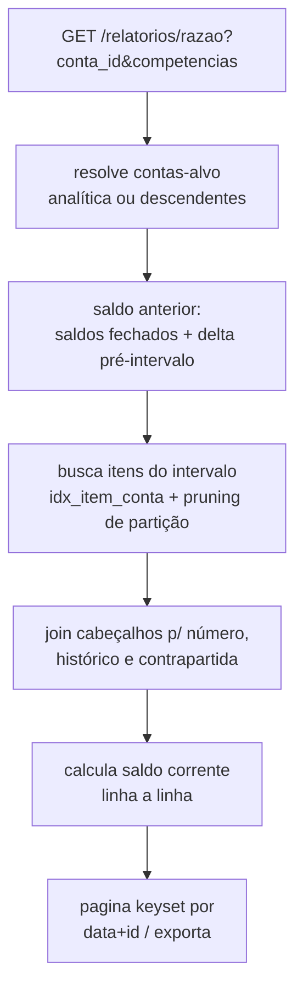

# SPECS/GENERAL_LEDGER.md — Livro Razão (e Livro Diário)

## 1. Objetivo

Implementar os dois livros obrigatórios: **Razão** (movimentação por conta com saldo corrente) e **Diário** (registro cronológico integral), com geração por competência, paginação eficiente e exportação.

## 2. Responsabilidades

- Razão: extrato fiel de qualquer conta analítica (ou consolidado de sintética) em qualquer intervalo de competência.
- Diário: listagem cronológica completa, numerada e sem lacunas (base ECD I200/I250).
- Garantir RR-01, RR-05 e reconciliação com Balancete.

## 3. Regras de Negócio

1. Apenas lançamentos `contabilizado` e `estornado` (estes sempre acompanhados do estorno) — nunca `rascunho`.
2. **Saldo anterior** do Razão: `ctb_saldo_contabil.saldo_final` do último período fechado antes do intervalo + delta de itens entre o início do período aberto e a data inicial solicitada.
3. Saldo corrente recalculado linha a linha: `saldo += (tipo=='D' ? valor : -valor)` (bruto); apresentação conforme natureza.
4. Razão de conta sintética = união ordenada dos itens das analíticas descendentes (com coluna da conta).
5. Diário ordenado por `(data_competencia, numero)`; verificação de lacuna de numeração no exercício gera alerta no rodapé.
6. Contrapartida exibida no Razão: se o lançamento tem só 2 itens, mostra a outra conta; se composto, mostra "diversos" + link para o lançamento.

## 4. Entidades

Leitura de `ctb_lancamento`, `ctb_lancamento_item`, `ctb_conta_contabil`, `ctb_saldo_contabil`. Nenhuma escrita.

## 5. Fluxos



## 6. Query de referência (Razão, período aberto)

```sql
SELECT li.data_competencia, l.numero, l.historico, li.tipo, li.valor, li.lancamento_id
FROM ctb_lancamento_item li
JOIN ctb_lancamento l ON l.id = li.lancamento_id
WHERE li.empresa_id = :empresa
  AND li.conta_id   = :conta
  AND li.data_competencia BETWEEN :de AND :ate
  AND l.status IN ('contabilizado','estornado')
ORDER BY li.data_competencia, l.numero, li.id
LIMIT :pagina;
```

(Partition pruning por `data_competencia`; saldo anterior vem de `ctb_saldo_contabil` — nunca somar histórico inteiro.)

## 7. Validações

1. `conta_id` existente, da empresa, ativa ou inativa (inativa pode ser consultada).
2. Intervalo ≤ 24 meses por requisição (relatórios maiores → exportação assíncrona).
3. Reconciliação automática: saldo final do Razão == saldo da conta no Balancete do mesmo recorte (teste de release, QA).
4. Diário: `Σ débitos == Σ créditos` do período; lacuna de numeração → alerta `SEQUENCE_GAP` no relatório e log interno.

## 8. Exemplos

### Razão — 1.1.2.001.0001 Clientes Nacionais, 06/2026

| Data | Lanç. | Histórico | Contrapartida | Débito | Crédito | Saldo |
|---|---|---|---|---|---|---|
| — | — | **Saldo anterior** | | | | **40.000,00 D** |
| 02/06 | 4498 | Emissão duplicata 000122 | 4.1.1.001 | 2.500,00 | | 42.500,00 D |
| 04/06 | 4502 | Liquidação boleto 000123 | diversos | | 1.050,00 | 41.450,00 D |
| | | **Totais / Saldo final** | | **2.500,00** | **1.050,00** | **41.450,00 D** |

### Diário — trecho

```
Lançamento 4502 — 04/06/2026 — Liquidação do boleto 000123 - Cliente X
  D 1.1.1.002.0001 Banco BTG ................................. 1.040,00
  D 6.2.1.001 Despesas Financeiras / Tarifas .................     10,00
  C 1.1.2.001.0001 Clientes Nacionais ........................ 1.050,00
```
