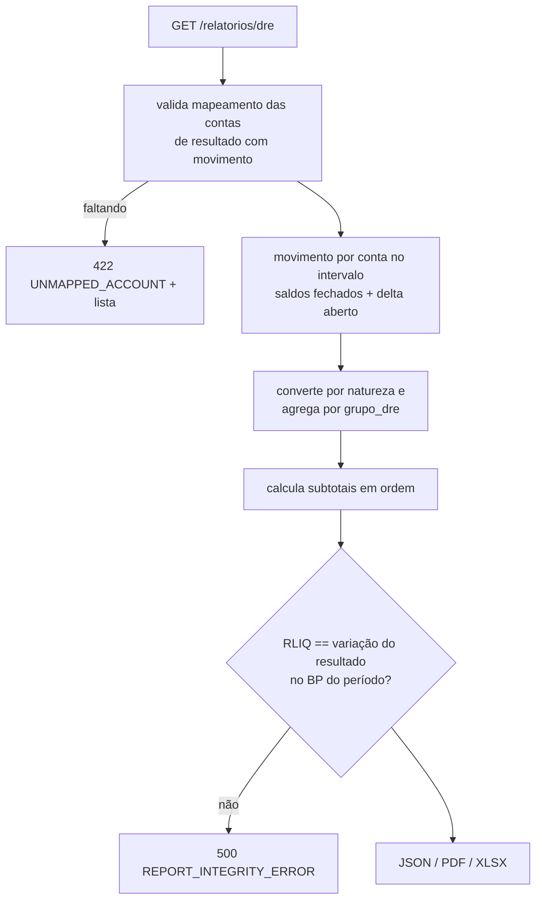

# SPECS/INCOME_STATEMENT.md — DRE (Demonstração do Resultado do Exercício)

## 1. Objetivo

Implementar a DRE por competência, montada a partir de `ctb_grupo_dre` (estrutura) + saldos das contas de resultado mapeadas, com subtotais em cascata, comparativos mensais/acumulados e versão gerencial por centro de custo (CPC 26).

## 2. Responsabilidades

- Calcular cada linha da DRE a partir dos saldos do **movimento do período** (não acumulado desde sempre — contas de resultado zeram a cada exercício).
- Garantir conciliação com o Balanço (resultado líquido = linha "Resultado do Período" do PL).

## 3. Regras de Negócio

1. Apenas contas `tipo IN ('receita','custo','despesa')` analíticas, cada uma mapeada a um `grupo_dre` (RP-05); não mapeada → 422 `UNMAPPED_ACCOUNT` com lista.
2. Valor da linha = Σ movimento do período das contas do grupo, convertido por natureza: receita (credora) positiva = `créditos − débitos`; custo/despesa/dedução (devedora) = `débitos − créditos`, exibida negativa quando `tipo_operacao='subtracao'`.
3. Subtotais (`tipo_operacao='subtotal'`) calculados em cascata pela `ordem` — nunca somando contas diretamente.
4. Intervalo multi-período: coluna por mês + coluna acumulado (`comparativo=mensal`), ou somente acumulado.
5. Estornos líquidos no período (receita estornada reduz a linha).
6. Por centro de custo: usa saldos/itens com distribuição (`ctb_lancamento_item_custo`); itens de resultado sem distribuição aparecem na coluna "(não rateado)".

## 4. Entidades

Leitura: `ctb_grupo_dre`, `ctb_conta_contabil`, `ctb_saldo_contabil` (movimento = `total_debitos`/`total_creditos` do período), delta do aberto.

## 5. Estrutura modelo (seed `ctb_grupo_dre`)

| Ordem | Código | Descrição | Operação |
|---|---|---|---|
| 10 | RB | Receita Bruta | soma |
| 20 | DED | (-) Deduções da Receita | subtracao |
| 30 | RL | (=) Receita Líquida | subtotal (RB−DED) |
| 40 | CMV | (-) Custos | subtracao |
| 50 | LB | (=) Lucro Bruto | subtotal (RL−CMV) |
| 60 | DOP | (-) Despesas Operacionais | subtracao |
| 70 | ROP | (=) Resultado Operacional | subtotal (LB−DOP) |
| 80 | RF | (±) Resultado Financeiro | soma (líquido) |
| 90 | RAIR | (=) Resultado antes IR/CSLL | subtotal (ROP+RF) |
| 100 | IR | (-) IR e CSLL | subtracao |
| 110 | RLIQ | (=) Resultado Líquido do Período | subtotal (RAIR−IR) |

## 6. Fluxo



## 7. Validações

1. Toda conta de resultado com movimento no intervalo tem `grupo_dre_id`.
2. Subtotal calculado confere com soma manual nos testes (3 cenários do Accounting Analyst).
3. Conciliação DRE × BP (mesma competência) automática a cada geração.
4. Períodos abertos → aviso RR-04.

## 8. Exemplos

DRE 06/2026 (acumulado do mês):

```
Receita Bruta ............................  30.000,00
(-) Deduções da Receita ..................  (1.000,00)
(=) Receita Líquida ......................  29.000,00
(-) Custos ............................... (12.000,00)
(=) Lucro Bruto ..........................  17.000,00
(-) Despesas Operacionais ................  (7.500,00)
(=) Resultado Operacional ................   9.500,00
(±) Resultado Financeiro .................     (460,00)   [juros 50,00 − tarifas/desp. 510,00]
(=) Resultado antes IR/CSLL ..............   9.040,00
(-) IR e CSLL ............................  (1.085,00)
(=) Resultado Líquido do Período .........   7.955,00
```

Conciliação: PL no BP de 06/2026 deve exibir "Resultado do Período: 7.955,00".
