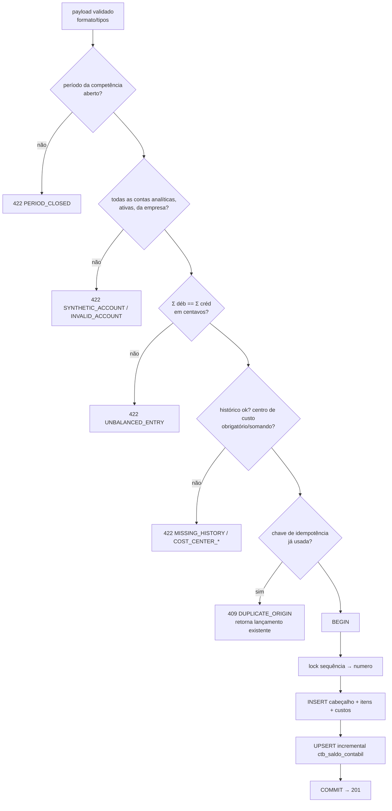

# SPECS/JOURNAL_ENTRIES.md — Lançamentos Contábeis

## 1. Objetivo

Implementar o motor de lançamentos: criação (manual, integração, lote), contabilização com partidas dobradas, numeração sequencial, estorno, histórico padronizado e atualização incremental de saldos. É o coração do módulo — correção aqui é inegociável.

## 2. Responsabilidades

- Garantir RL-01..RL-13 (`CONTEXT/BUSINESS_RULES.md` §4) em toda via de entrada (API manual, worker de integração, importação em lote).
- Manter `ctb_saldo_contabil` consistente em tempo real (RS-01..RS-04).
- Prover trilha de auditoria completa.

## 3. Regras de Negócio

Todas as RL-* e a ordem de validação de `BUSINESS_RULES.md` §11. Complementos de implementação:

1. **Transação única**: cabeçalho + itens + distribuições de custo + atualização de saldo + numeração — tudo em `BEGIN ... COMMIT`; qualquer falha = rollback total.
2. **Numeração**: tabela `ctb_sequencia (empresa_id, exercicio, proximo_numero)` lida com `SELECT ... FOR UPDATE` dentro da transação de contabilização — sem lacunas, sem corrida.
3. **Equilíbrio**: comparação em centavos inteiros (converter `DECIMAL` para inteiro ×100) — nunca float.
4. **Histórico**: se `historico_padrao_id` informado, resolver placeholders com `historico_complemento`/dados do payload e gravar o texto final em `historico` (desnormalizado para ECD e busca).
5. **Estorno**: copia itens com `tipo` invertido, mesma distribuição de custo, `origem_tipo='estorno'`, vínculo bidirecional (original recebe `status='estornado'`).
6. **Lote**: cada lançamento do lote é uma transação independente; resposta lista sucesso/erro por índice; lote inteiro identificado por `lote_id`.

## 4. Entidades

`ctb_lancamento`, `ctb_lancamento_item`, `ctb_lancamento_item_custo`, `ctb_sequencia`, `ctb_periodo_contabil`, `ctb_historico_padrao` (ver `CONTEXT/DATABASE_MODEL.md`).

### `ctb_sequencia` (auxiliar desta SPEC)

| Campo | Tipo |
|---|---|
| id, empresa_id, created_at, updated_at | padrão |
| exercicio | SMALLINT UNSIGNED NOT NULL |
| proximo_numero | BIGINT UNSIGNED NOT NULL DEFAULT 1 |
| UNIQUE (empresa_id, exercicio) | |

## 5. Fluxos

### 5.1 Contabilização



### 5.2 Estorno

```mermaid
sequenceDiagram
    participant U as Usuário/Worker
    participant S as Serviço
    participant DB as MySQL
    U->>S: POST /lancamentos/1234/estornar {motivo}
    S->>DB: carrega 1234 (status=contabilizado? não é estorno?)
    alt inválido
        S-->>U: 422 INVALID_REVERSAL / IMMUTABLE_ENTRY
    end
    S->>S: competência: período aberto? senão usa corrente (RF-04)
    S->>DB: BEGIN; novo lançamento espelho (D↔C) + saldos; original.status='estornado'; COMMIT
    S-->>U: 201 {estorno_id, numero}
```

## 6. Validações (matriz de teste mínima)

| Caso | Resultado |
|---|---|
| 2 itens equilibrados | 201 contabilizado |
| 3+ itens equilibrados (composto) | 201 |
| Σ difere por 0,01 | 422 UNBALANCED_ENTRY |
| item com valor 0 ou negativo | 400 INVALID_AMOUNT |
| conta sintética | 422 SYNTHETIC_ACCOUNT |
| conta de outra empresa | 404 NOT_FOUND |
| competência em período fechado | 422 PERIOD_CLOSED |
| editar contabilizado | 422 IMMUTABLE_ENTRY |
| estornar estorno | 422 INVALID_REVERSAL |
| replay com mesma Idempotency-Key | 409 + lançamento original |
| 100 contabilizações concorrentes | números sequenciais sem lacuna/duplicata |
| centro de custo somando ≠ item | 422 COST_CENTER_MISMATCH |

## 7. Exemplos

### Lançamento composto (folha de pagamento simplificada)

| Conta | Tipo | Valor |
|---|---|---|
| 6.1.1.001 Despesas Administrativas (salários) | D | 50.000,00 |
| 2.1.3.001 Obrigações Trabalhistas (líquido a pagar) | C | 39.000,00 |
| 2.1.2.001 Obrigações Fiscais (INSS/IRRF retidos) | C | 11.000,00 |

Σ D = Σ C = 50.000,00 ✓ — com distribuição do item de despesa entre centros de custo `01` Adm (60%) e `02` Comercial (40%).

### Resolução de histórico padrão

Padrão `001`: "Recebimento da duplicata {documento} de {sacado}" + payload `{documento: "000123", sacado: "Cliente X"}` → `historico` final: "Recebimento da duplicata 000123 de Cliente X".
