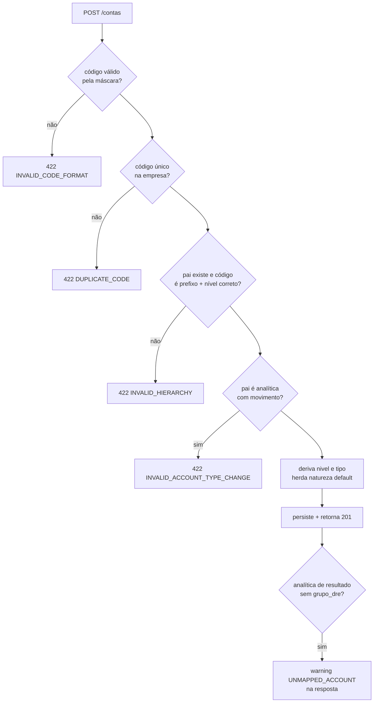

# SPECS/PLAN_OF_ACCOUNTS.md — Plano de Contas

## 1. Objetivo

Implementar o cadastro hierárquico de contas contábeis por empresa: CRUD, árvore, validações de hierarquia/natureza, mapeamento DRE/BP, importação de plano modelo (seed) e suporte à ECD (I050/I051).

## 2. Responsabilidades

- Manter a integridade da árvore (códigos, níveis, sintética/analítica).
- Prover a base para lançamentos (apenas analíticas ativas) e relatórios (agregação por hierarquia).
- Aplicar plano modelo em novas empresas.

## 3. Regras de Negócio

Aplicam-se RP-01..RP-07 e RE-01..RE-05 de `CONTEXT/BUSINESS_RULES.md`. Complementos:

1. Máscara de código configurável por empresa (default `9.9.99.999.9999`); validação por regex gerada da máscara.
2. Ao criar conta filha sob conta analítica **sem movimento**: o pai vira sintética automaticamente (com confirmação do usuário). Com movimento: bloqueado (`INVALID_ACCOUNT_TYPE_CHANGE`).
3. `tipo` é herdado da raiz (toda conta `1.*` é `ativo` etc.) e não editável fora da raiz.
4. Inativar conta sintética inativa em cascata as filhas **sem movimento**; se alguma filha tem movimento, operação rejeitada listando-as.
5. Reordenação/renumeração em massa só é permitida para contas sem movimento (ferramenta administrativa).

## 4. Entidades

`ctb_conta_contabil` (ver `CONTEXT/DATABASE_MODEL.md` §5.1). Relacionamentos: self (pai/filha), `ctb_grupo_dre`, `ctb_grupo_balanco`, itens de lançamento, saldos.

## 5. Fluxos

### 5.1 Criação de conta



### 5.2 Importação do plano modelo

`POST /contas/importar-modelo` → valida empresa sem contas (ou modo `mesclar`) → insere árvore seed em transação → vincula grupos DRE/BP modelo → retorna resumo (contas criadas).

## 6. Validações (checklist de implementação)

1. Regex da máscara; 2. unicidade `(empresa_id, codigo)`; 3. prefixo do pai + `nivel = pai.nivel + 1`; 4. natureza ∈ enum e imutável com movimento; 5. `aceita_lancamento` coerente (sem filhas); 6. mapeamento DRE para analíticas tipo receita/custo/despesa, BP para ativo/passivo/PL; 7. soft delete com checagem de movimento (`EXISTS` em `ctb_lancamento_item`); 8. `empresa_id` do token.

## 7. API

Ver `CONTEXT/API_SPECIFICATION.md` §4.1.

## 8. Exemplos

Alterar nome (permitido sempre): `PUT /contas/45 {"nome": "Clientes Nacionais e MERCOSUL"}` → 200.
Alterar código com movimento: `PUT /contas/45 {"codigo": "1.1.2.002"}` → 422 `HAS_MOVEMENTS`.

## 9. Plano de Contas Modelo (seed resumido)

```
1            ATIVO                                  [S, devedora]
1.1          ATIVO CIRCULANTE                       [S]
1.1.1        DISPONIBILIDADES                       [S]
1.1.1.001    Caixa                                  [A → BP: Ativo Circulante]
1.1.1.002    Bancos Conta Movimento                 [S]
1.1.1.002.0001  Banco BTG                           [A]
1.1.2        CRÉDITOS                               [S]
1.1.2.001    Clientes                               [S]
1.1.2.001.0001  Clientes Nacionais                  [A]
1.1.2.009    (-) Perdas Estimadas (PECLD)           [A, credora]
1.2          ATIVO NÃO CIRCULANTE                   [S]
1.2.3        IMOBILIZADO                            [S]
1.2.3.001    Máquinas e Equipamentos                [A]
1.2.3.099    (-) Depreciação Acumulada              [A, credora]
2            PASSIVO                                [S, credora]
2.1          PASSIVO CIRCULANTE                     [S]
2.1.1.001    Fornecedores                           [A]
2.1.2.001    Obrigações Fiscais                     [A]
2.1.3.001    Obrigações Trabalhistas                [A]
2.2          PASSIVO NÃO CIRCULANTE                 [S]
2.2.1.001    Empréstimos e Financiamentos LP        [A]
2.3          PATRIMÔNIO LÍQUIDO                     [S]
2.3.1.001    Capital Social                         [A]
2.3.4.001    Lucros ou Prejuízos Acumulados         [A]
4            RECEITAS                               [S, credora]
4.1.1.001    Receita de Vendas                      [A → DRE: Receita Bruta]
4.1.9.001    (-) Deduções da Receita                [A, devedora → DRE: Deduções]
4.2.1.001    Receitas Financeiras (Juros)           [A → DRE: Resultado Financeiro]
5            CUSTOS                                 [S, devedora]
5.1.1.001    CMV / Custo dos Serviços               [A → DRE: Custos]
6            DESPESAS                               [S, devedora]
6.1.1.001    Despesas Administrativas               [A → DRE: Desp. Operacionais]
6.1.2.001    Despesas Comerciais                    [A → DRE: Desp. Operacionais]
6.2.1.001    Despesas Financeiras / Tarifas         [A → DRE: Resultado Financeiro]
6.3.1.001    IR e CSLL                              [A → DRE: IR/CSLL]
7            APURAÇÃO DO RESULTADO                  [S]
7.1.1.001    ARE - Apuração do Resultado            [A, transitória]
```

`[S]`=sintética, `[A]`=analítica. O seed completo (arquivo SQL/JSON) é gerado na Fase 0 a partir desta estrutura, com mapeamentos DRE/BP preenchidos.
