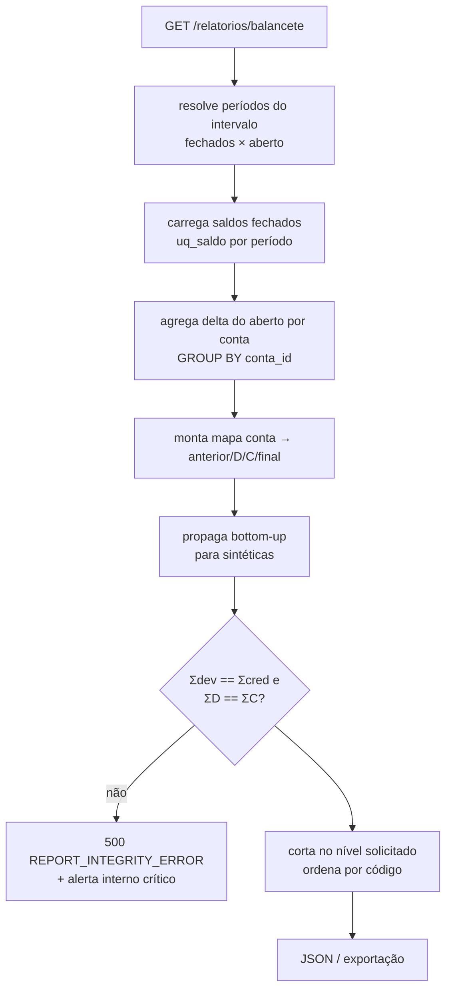

# SPECS/TRIAL_BALANCE.md — Balancete de Verificação

## 1. Objetivo

Implementar o Balancete: visão de todas as contas com saldo anterior, débitos, créditos e saldo final do intervalo de competência, com agregação hierárquica e prova de equilíbrio. É o relatório-verdade do sistema e a base de consolidação de DRE/BP.

## 2. Responsabilidades

- Gerar balancete por intervalo de competência, nível de detalhe e (opcional) centro de custo.
- Provar `Σ saldos devedores = Σ saldos credores` e `Σ débitos = Σ créditos` (RR-02) — divergência é bug bloqueante, nunca mascarada.

## 3. Regras de Negócio

1. Fonte: `ctb_saldo_contabil` para períodos fechados + delta do aberto (RS-04).
2. `saldo_anterior` = saldo final acumulado até o mês anterior ao intervalo (bruto D−C).
3. Sintéticas: soma bottom-up das analíticas descendentes; exibição até o `nivel` solicitado.
4. Colunas devedora/credora: saldo bruto positivo → coluna devedora; negativo → credora (valor absoluto). A natureza da conta serve para destacar **saldo invertido** (ex.: Caixa credor) com flag `saldo_invertido: true`.
5. `somente_com_movimento=true` oculta contas com tudo zerado no intervalo.
6. Com `centro_custo_id`: usa saldos por centro (somente contas com distribuição; o balancete por centro **não** fecha em zero e exibe aviso "visão gerencial parcial").

## 4. Entidades

Leitura: `ctb_saldo_contabil`, `ctb_lancamento_item` (delta), `ctb_conta_contabil`, `ctb_periodo_contabil`.

## 5. Fluxo



## 6. Query de referência (delta do período aberto)

```sql
SELECT li.conta_id,
       SUM(CASE WHEN li.tipo='D' THEN li.valor ELSE 0 END) AS debitos,
       SUM(CASE WHEN li.tipo='C' THEN li.valor ELSE 0 END) AS creditos
FROM ctb_lancamento_item li
JOIN ctb_lancamento l ON l.id = li.lancamento_id
WHERE li.empresa_id = :empresa
  AND li.data_competencia BETWEEN :inicio_aberto AND :ate
  AND l.status IN ('contabilizado','estornado')
GROUP BY li.conta_id;
```

## 7. Validações

1. Intervalo válido (`de ≤ até`); empresa do token; permissão `contabilidade.visualizar`.
2. Equilíbrio global (seção 5) — testes QA comparam com soma bruta dos itens em base de homologação.
3. Reconciliação com Razão (saldo por conta) e com Diário (totais D/C) — suite de release.
4. Períodos abertos no intervalo → `periodo_encerrado: false` + selo no PDF (RR-04).

## 8. Exemplos

Balancete nível 1, 01–03/2026 (valores apresentados):

| Conta | Saldo anterior | Débitos | Créditos | Saldo final |
|---|---|---|---|---|
| 1 ATIVO | 150.000,00 D | 80.000,00 | 65.000,00 | 165.000,00 D |
| 2 PASSIVO (incl. PL) | 150.000,00 C | 20.000,00 | 25.000,00 | 155.000,00 C |
| 4 RECEITAS | 0,00 | 1.000,00 | 31.000,00 | 30.000,00 C |
| 5 CUSTOS | 0,00 | 12.000,00 | 0,00 | 12.000,00 D |
| 6 DESPESAS | 0,00 | 8.000,00 | 0,00 | 8.000,00 D |
| **Totais** | | **121.000,00** | **121.000,00** | **dev 185.000,00 = cred 185.000,00** |

Prova: 165.000 (D) + 12.000 + 8.000 = 185.000 = 155.000 (C) + 30.000 ✓
